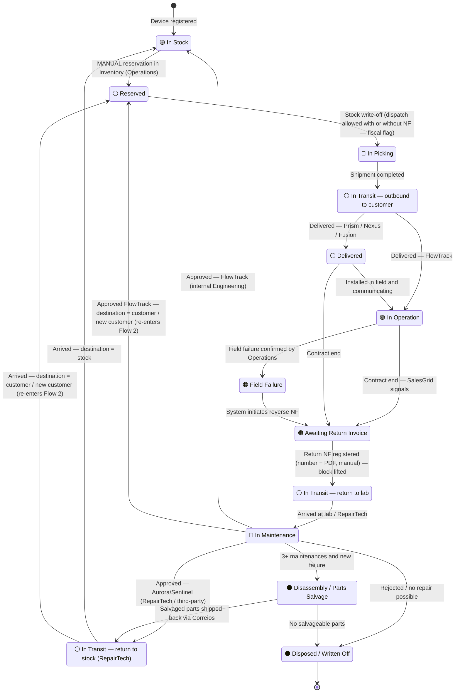

# General Device State Diagram

## All possible states

| Status                             | Emoji | When it occurs                                                                                                                              |
| ---------------------------------- | ----- | ------------------------------------------------------------------------------------------------------------------------------------------- |
| In Stock                           | 🟡    | After registration; after approved maintenance; after reservation cancellation                                                              |
| Reserved                           | ⚪     | Contract reservation approved by Operations                                                                                                 |
| In Picking                         | 🔵    | Dispatch NF registered — device released for shipment                                                                                       |
| In Transit — outbound              | ⚪     | Shipment completed toward the customer                                                                                                      |
| Delivered                          | ⚪     | Delivered to customer — Prism / Nexus / Fusion only (awaiting installation)                                                                 |
| In Operation                       | 🟢    | FlowTrack: upon delivery. Prism/Nexus/Fusion: upon commissioning in Aurora/Sentinel. Sub-status: ✅ Communicating / ⚠️ Communication Failure |
| Field Failure                      | 🟠    | Swap confirmed by Operations after remote detection (Aurora/Sentinel > 7 days without communication) or customer report (FlowTrack via CSI) |
| Awaiting Return Invoice            | 🟠    | System awaits return NF — **fiscal BLOCK**                                                                                                  |
| In Transit — return                | ⚪     | NF issued — device on its way to lab / RepairTech / Engineering                                                                             |
| In Maintenance                     | 🔴    | Device on the bench — external RepairTech (Prism/Nexus) or internal Engineering (FlowTrack)                                                 |
| In Transit — return to stock       | ⚪     | External RepairTech only (Prism/Nexus approved) — returning to Novus Tech via Correios                                                      |
| Disassembly / Parts Salvage        | ⚫    | Device reached the 3-maintenance limit and failed again — disassembled for parts; salvageable parts shipped back via Correios               |
| Disposed / Written Off             | ⚫     | Rejected in maintenance / end of useful life; or after disassembly with no salvageable parts                                                |

> **Note on "In Transit — return to stock":** This state applies only to devices that went through **external RepairTech** (Prism/Nexus/Fusion). Devices that went through **internal Engineering** (FlowTrack) go directly to 🟡 In Stock, since maintenance is performed within the company.

---

## Parallel fiscal dimension (dispatch)

Beyond the **logistic** status above, the **stock write-off on dispatch** carries an independent **fiscal status**:

| Fiscal Status | When it occurs |
|---|---|
| 🟡 **Pending Invoice** | Stock write-off done **without** the NF number — dispatch allowed, but flagged for regularization |
| ✅ **Final Write-Off** | NF provided (number + PDF) — at write-off or in subsequent regularization |

> This flag does **not** replace the logistic status — it accompanies it. E.g.: a device can be 🔵 *In Picking* **and** 🟡 *Pending Invoice*. There is no hard block on dispatch in this phase (replaced by this flag). The **hard block remains only on return entry** (Awaiting Return Invoice, see below).

---

## Complete state diagram

> **Destination after maintenance:** upon approval, the device does not always return to stock — it may go **directly to the current customer** or be **reassigned to a new customer**, re-entering Flow 2 (state ⚪ Reserved).

---

## Transition rules (dev reference)

| From | To | Mandatory condition |
|---|---|---|
| In Stock | Reserved | **MANUAL reservation** in Inventory environment (Operations). Not automatic; not reflected in Omie |
| Reserved | In Picking | **Stock write-off** — dispatch allowed **with or without** NF. Fiscal flag: `Final Write-Off` (with NF + PDF) or `Pending Invoice` (without NF) |
| In Picking | In Transit outbound | Shipment registered with tracking code |
| In Transit outbound | In Operation | Correios API confirms delivery **AND** type = FlowTrack |
| In Transit outbound | Delivered | Correios API confirms delivery **AND** type = Prism / Nexus / Fusion |
| Delivered | In Operation | Commissioned in Aurora / Sentinel — Prism/Nexus/Fusion |
| In Operation | Field Failure | **After Operations analysis.** Detection: Aurora/Sentinel > 7 days without communication — limit is **fixed** (Prism/Nexus/Fusion) or customer report via CSI (FlowTrack) |
| In Operation | Awaiting Return Invoice | SalesGrid signals contract termination |
| Delivered | Awaiting Return Invoice | SalesGrid signals contract termination |
| Field Failure | Awaiting Return Invoice | Automatic — system initiates reverse NF flow |
| Awaiting Return Invoice | In Transit return | `Return NF Number` registered **manually** + **PDF attached** — block lifted |
| In Transit return | In Maintenance | Entry registered — destination by model: Aurora/Sentinel → third-party; FlowTrack → own stock |
| In Maintenance | In Transit return to stock | Technician records approval **AND** type = Prism / Nexus / Fusion (external RepairTech / third-party) |
| In Maintenance | In Stock | Technician records approval **AND** type = FlowTrack (internal Engineering — direct), **if destination = stock** |
| In Maintenance | Reserved | Approved **AND** destination = current / new customer → re-enters Flow 2 |
| In Transit return to stock | In Stock | Arrival registered at Novus Tech (Correios tracking), **if destination = stock** |
| In Transit return to stock | Reserved | Arrival registered **AND** destination = customer / new customer → re-enters Flow 2 |
| In Maintenance | Disassembly / Parts Salvage | 3 maintenances reached and device fails again → disassembled; salvageable parts shipped back via Correios |
| In Maintenance | Disposed / Written Off | Technician records rejection / no repair possible |
| Disassembly / Parts Salvage | In Transit return to stock | Salvaged parts shipped back via Correios |
| Disassembly / Parts Salvage | Disposed / Written Off | No salvageable parts — device fully written off |

