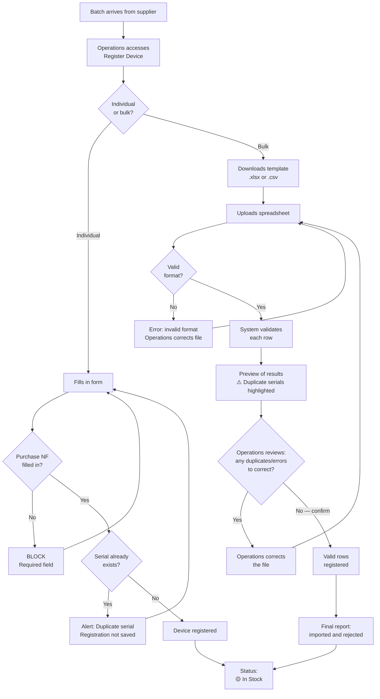

---
tags:
  - asset-management
  - flow
created: 2026-06-02
status: closed
related:
  - "[[general-context]]"
  - "[[flow-02-provisioning-and-dispatch]]"
---

# Flow 1: Device Receiving and Registration

> Owner: Amanda
> Status: ✅ Closed
> Updated: 2026-06-02

---

## 1. Overview

This flow covers the moment a batch of devices arrives from the supplier. Operations registers each device in the system — individually or in bulk via spreadsheet — and at the end each device is available in stock with status **In Stock**, ready to be reserved for a contract.

---

## 2. Actors and roles

| Actor | Role |
| --- | --- |
| **Operations** | Sole human actor. Performs individual registration or imports a bulk spreadsheet. |
| **System** | Validates required fields, checks for serial duplicates, updates status, and provides a downloadable spreadsheet template. |

---

## 3. Trigger

Arrival of a batch of devices from the supplier.

---

## 4. Pre-conditions

- Operations user authenticated in the system.
- Purchase Invoice (NF) for the batch available (number and issue date are required fields — registration cannot be completed without them).

---

## 5. Main flow (happy path)

### 5.1 Individual registration

| Step | Who | What they do | What happens |
| --- | --- | --- | --- |
| 1 | Operations | Accesses **Stock → Register new device** | Registration form is displayed |
| 2 | Operations | Fills in all required fields | — |
| 3 | System | Checks if the `Serial Number` already exists | — |
| 4 | System | Confirms registration | Device registered |
| 5 | System | Updates status | 🟡 **In Stock** |

### 5.2 Bulk registration

| Step | Who | What they do | What happens |
| --- | --- | --- | --- |
| 1 | Operations | Accesses **Stock → Import devices in bulk** | Import screen displayed |
| 2 | Operations | Clicks **"Download template"** | `.xlsx` and `.csv` template available for download |
| 3 | Operations | Fills in the spreadsheet with batch data | — |
| 4 | Operations | Uploads the file | — |
| 5 | System | Validates file format | — |
| 6 | System | Validates each row: required fields and unique serials | Invalid rows are flagged with reason |
| 7 | System | Displays **preview** of results, **highlighting duplicate serials** | Operations reviews before confirming |
| 8 | Operations | Corrects duplicates/errors (if any) and confirms import | — |
| 9 | System | Imports valid rows | Devices registered |
| 10 | System | Displays final import report | Total imported / total rejected (with reason per row) |
| 11 | System | Updates status of each imported device | 🟡 **In Stock** |

---

## 6. Alternative and exception flows

| Situation | What the system does |
| --- | --- |
| **Purchase NF not filled (individual)** | Blocks registration. Displays: *"Purchase NF Number is required."* Does not allow proceeding. |
| **Duplicate serial (individual)** | Immediate alert: *"A device with this serial already exists in the system."* Registration not saved. Operations must correct and retry. |
| **Duplicate serial (bulk)** | The row with the duplicate serial is rejected. Remaining valid rows are imported normally. Final report indicates which serials were rejected. |
| **Invalid file format (bulk)** | Error: *"Format not recognized. Use .xlsx or .csv with the standard template."* Upload cancelled. |
| **Required fields blank in spreadsheet** | The row is rejected with indication of the missing field. Remaining rows are imported normally. |

---

## 7. Business rules

- **BR-01:** Only **Operations** can register devices.
- **BR-02:** `Purchase NF Number` and `Issue Date` are **required**. Without them, registration cannot be completed.
- **BR-03:** The `Serial Number` is the **primary key** — must be unique in the system. The system prevents duplicates in real time.
- **BR-04:** Bulk registration accepts only `.xlsx` and `.csv` **in the standard template** provided by the system.
- **BR-05:** The spreadsheet template must be available for direct download on the bulk import screen.
- **BR-06:** The initial status of any registered device is always 🟡 **In Stock**.
- **BR-07:** In bulk registration, before confirming the import, the system must display a **preview** of results with **duplicate serials highlighted**, allowing Operations to correct before completing.

---

## 8. States

Only one transition occurs in this flow:

```
[Not in system] ──► 🟡 In Stock
```

---

## 9. Data involved

### Required fields (form and spreadsheet)

| Field | Type | Notes |
| --- | --- | --- |
| `Purchase NF Number` | Text | Fiscal document for the batch — required |
| `NF Issue Date` | Date (DD/MM/YYYY) | Purchase NF date — required |
| `Serial Number` | Text | Primary key — must be unique |
| `Type` | Selection | Prism \| Nexus \| Fusion \| DataHub FlowTrack |
| `Technology` | Selection | CAT1 Bis \| NB-IoT |
| `Supplier` | Selection | Board \| Sensor \| Complete Assembly |
| `Manufacturing Year` | Year (YYYY) | — |

### Optional fields

| Field | Type | Notes |
| --- | --- | --- |
| `IMEI Number` | Text | SIM card identifier |
| `ICCID Number` | Text | SIM card identifier |

### Fields automatically generated by the system

| Field | Assigned value |
|---|---|
| `Status` | 🟡 In Stock |
| `Registration Date` | Date and time of registration |
| `Maintenance Counter` | 0 (initial value) |

---

## 10. Integrations / external systems

None. Registration is 100% internal.

---

## 11. Open gaps and questions

| ID | Question | Owner |
| --- | --- | --- |
| P-02 | What are the access levels for CS and Engineering? Can they view device registration in the stock module? | Amanda |

---

## 12. Diagram


