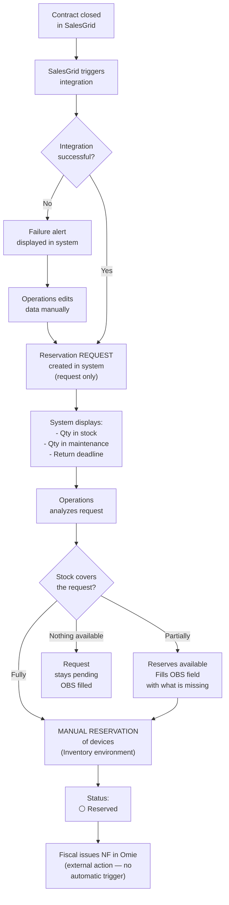
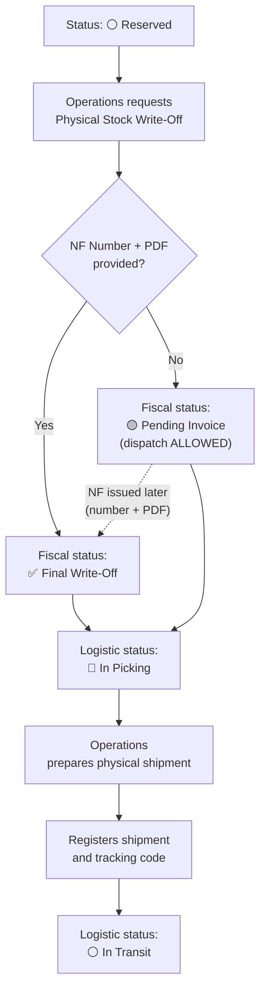
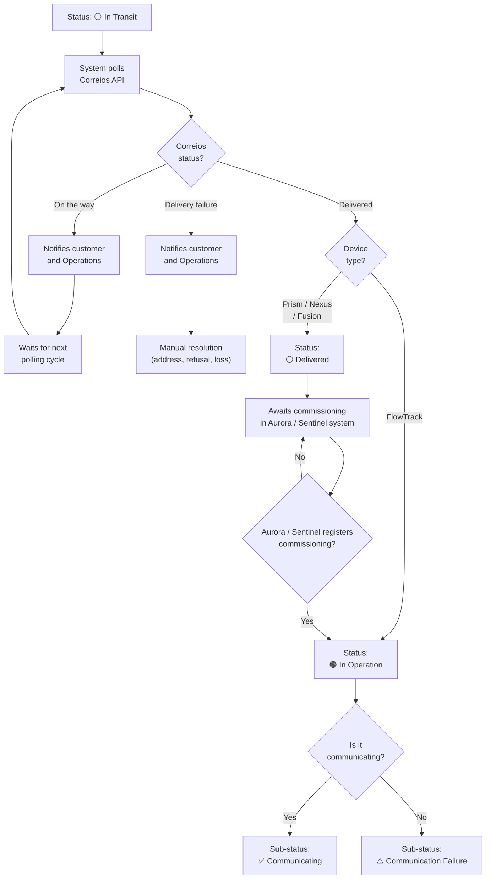

---
tags:
  - asset-management
  - flow
created: 2026-06-02
updated: 2026-06-09
status: closed
related:
  - "[[general-context]]"
  - "[[flow-01-receiving-and-registration]]"
  - "[[flow-03-reverse-logistics]]"
---

# Flow 2: Provisioning and Dispatch

> Owner: Amanda
> Status: ✅ Closed — revised 2026-06-09 (Inventory × Fiscal knowledge base)
> Updated: 2026-06-09

---

## 1. Overview

This flow covers the entire path of a device from reservation (originated by a contract closed in SalesGrid) until it reaches the customer and enters operation. It is the core business flow and involves three teams (Operations, Finance/Fiscal, and the Correios tracking system), plus SalesGrid and Correios as active external integrations. **Omie remains the ERP where Fiscal issues the NF, but with no native integration in this phase** — the NF number is manually registered in the system, with the PDF attached (see revision above).

The flow is divided into three stages:
- **2A — Reservation:** contract in SalesGrid generates a device **request**; Operations **manually reserves** available devices in Inventory.
- **2B — NF and Stock Write-Off:** Fiscal issues the NF in Omie; Operations **registers the number and attaches the PDF** in the system; the stock write-off releases the shipment (with fiscal pending treatment — see 5A).
- **2C — Dispatch and Tracking:** device dispatched; Correios tracks; customer receives; final status depends on device type.

---

## 2. Actors and roles

| Actor | Role |
| --- | --- |
| **SalesGrid** (external system) | Triggers automatic creation of the reservation **request** when a contract is closed |
| **Operations** | **Manually reserves** available devices in Inventory; registers the NF number and attaches the PDF; prepares the physical shipment |
| **Finance / Fiscal** | Issues the dispatch NF in Omie |
| **Omie** (external system) | ERP where the dispatch NF is issued. **No native integration in this phase** — the NF number is manually registered in the system. Automatic capture via API = Future Phase (Back-end), see section 10 |
| **System** | Creates the request from SalesGrid, controls manual reservation, registers the NF and PDF, flags fiscal pending when NF is not provided, registers tracking, updates status |
| **Correios** (external API) | Provides tracking status via polling |
| **Customer** | Receives the device; for Prism/Nexus/Fusion, performs installation |

---

## 3. Trigger

Contract closed in SalesGrid with device type and quantity fields filled in.

---

## 4. Pre-conditions

- Device type and quantity fields **already exist in SalesGrid** and must be filled in the contract.
- At least one device with status 🟡 **In Stock** must exist for the requested type (otherwise approval will be partial or denied).
- The device purchase NF must be registered (devices must already be in the system).

---

## 5. Main flow (happy path)

### Stage 2A — Reservation via SalesGrid

| Step | Who | What they do | What happens |
|---|---|---|---|
| 1 | SalesGrid | Contract closed — device field filled | Integration fires to the management system |
| 2 | System | Reads type and quantity from the SalesGrid contract | Reservation **request** automatically created (request only — not device reservation) |
| 3 | System | Displays for Operations: available stock, quantity in maintenance, maintenance return deadline | — |
| 4 | Operations | Analyzes the request | — |
| 5 | Operations | **Manually reserves** available devices in stock (individual selection in Inventory environment) | — |
| 6 | System | Updates status of reserved devices | ⚪ **Reserved** |
| 7 | Fiscal | Issues dispatch NF in Omie (external action — no automatic trigger from the system in this phase) | — |

> **🔒 100% manual reservation:** Device reservation is a **manual process, restricted to the Inventory environment**. The system **does not auto-generate reservations** and **does not reflect reservations in Omie** — the ERP does not support this reservation concept, compounded by the nomenclature mismatch (Inventory uses operational names, e.g. `NVT-45205`; Fiscal uses technical/accounting names, e.g. `Prism-v2-R3`). SalesGrid only creates the **request**; Operations always handles device reservation.

> **Partial approval case:** if stock is lower than the requested quantity, Operations reserves what is available, fills the **OBS** field with what is missing and when it will be dispatched (e.g. *"Requested 100. Sending 80. The remaining 20 will be dispatched on XX/XX/XXXX"*), and the system records the request as partially fulfilled.

---

### Stage 2B — NF and Stock Write-Off

| Step | Who | What they do | What happens |
|---|---|---|---|
| 1 | Fiscal | Accesses Omie and issues the dispatch NF | NF issued in Omie |
| 2 | Operations | Requests **Physical Stock Write-Off** of reserved devices | System displays required fields: `Dispatch NF Number` + `NF PDF Upload` |
| 3 | Operations | **Enters the NF number and attaches the PDF** | — |
| 4 | System | Validates and registers the NF | Fiscal status → ✅ **Final Write-Off**; logistic status → 🔵 **In Picking** |
| 5 | Operations | Prepares the physical shipment | — |
| 6 | Operations | Registers the shipment in the system (with tracking code) | — |
| 7 | System | Updates status | ⚪ **In Transit** |

> **🟡 Dispatch without NF:** When requesting the Physical Stock Write-Off, **if the NF number is NOT provided**, the system **allows the physical dispatch** anyway, but flags the batch with fiscal status **`Pending Invoice`**. The device proceeds to 🔵 **In Picking** → ⚪ **In Transit** carrying this pending flag, which **must be regularized** when the NF is issued (number + PDF) — at which point the fiscal status becomes **`Final Write-Off`**. Full rule detail in **section 5A**.

> **Why relax the block:** The previous hard block (which prevented any dispatch without NF) was replaced by this fiscal pending model because, in this phase, the focus is **operational efficiency** and **gradual sanitation** of physical stock (target > 90% reliability). Blocking dispatch would freeze operations; flagging as pending maintains an auditable trail without stopping business.

> **Future Phase (Back-end):** When Omie integration is available, the NF number can be **automatically pulled** via API (NF-e Consultas) and the PDF/DANFE retrieved via NF-e Utilities, eliminating manual entry. See section 10.

#### 5A — Stock Write-Off Rule (dev reference)

Physical stock write-off behavior, step by step:

1. When requesting the **Physical Stock Write-Off**, the system mandatorily **requests** the `Dispatch NF Number` and **NF PDF upload**.
2. **If the number is NOT entered:** the system **allows physical dispatch**, but flags the batch with fiscal status **`Pending Invoice`**. Dispatch (In Picking → In Transit) proceeds normally.
3. **If the number IS entered (with PDF):** the system validates the operation and sets fiscal status to **`Final Write-Off`**.
4. A batch/device in **`Pending Invoice`** must appear highlighted for Operations/Fiscal and can be **regularized at any time** by providing the NF number and attaching the PDF — transitioning to **`Final Write-Off`**.

> The **fiscal** status (`Pending Invoice` / `Final Write-Off`) is a **parallel dimension** to the **logistic** status (Reserved → In Picking → In Transit → …). A device can be 🔵 In Picking **and** `Pending Invoice` at the same time.

---

### Stage 2C — Dispatch, Tracking and Delivery

| Step | Who | What they do | What happens |
|---|---|---|---|
| 1 | System | Starts polling Correios API with tracking code | — |
| 2 | Correios API | Returns tracking status | System updates view |
| 3 | System | Notifies customer and Operations on each status change | — |
| 4 | Correios API | Returns **"Delivered"** status | — |
| 5 | System | Checks device type | Path diverges (see below) |

**If the device is FlowTrack:**
- Status changes directly to 🟢 **In Operation** (no installation required).

**If the device is Prism, Nexus or Fusion:**
- Status changes to ⚪ **Delivered** (device is with the customer, awaiting installation and commissioning).
- Customer installs the device and registers it as **Commissioned** in Aurora (Prism) or Sentinel (Nexus/Fusion).
- Aurora/Sentinel integration detects commissioning → status changes to 🟢 **In Operation**.
- In **In Operation**, the system checks device communication and assigns a sub-status:
  - ✅ **Communicating** — device transmitting data normally.
  - ⚠️ **Communication Failure** — device registered as in operation, but not transmitting data.

---

## 6. Alternative and exception flows

| Situation | What happens |
|---|---|
| **SalesGrid integration fails to create request** | System displays failure alert. Request fields remain editable for Operations to correct and create manually. |
| **Request data arrives incorrectly from SalesGrid** | Fields are editable before approval. Operations corrects and approves. |
| **Insufficient stock (partial)** | Operations approves what is available, fills OBS with what is missing and the expected dispatch date for the remainder. |
| **Missing devices arrive in stock (complement)** | Operations completes the partial request **manually**, selecting the devices **in bulk** (e.g. selects the 20 missing devices at once). See BR-08. |
| **Zero stock for requested type** | Operations cannot approve. Fills OBS with the situation and forecast. Request stays pending. |
| **Dispatch NF not yet issued at write-off time** | Physical dispatch is **allowed**; the batch is flagged as `Pending Invoice`. The pending must be regularized (number + PDF) once the NF is issued — transitioning to `Final Write-Off`. |
| **NF PDF unavailable, only the number** | Registers the number and keeps the batch flagged as pending the attachment until PDF is uploaded. (Full `Final Write-Off` requires both number **and** PDF.) |
| **Delivery failure (wrong address, refusal, loss)** | Correios API returns failure status. Customer and Operations are notified. Manual resolution between parties. |

---

## 7. Business rules

- **BR-01:** Physical dispatch is **no longer blocked** by the absence of an NF. When writing off stock, the system **requests** the `Dispatch NF Number` + PDF; if not provided, **allows dispatch** and flags the batch as `Pending Invoice`; if provided, sets `Final Write-Off`. *(Replaces the old hard block.)*
- **BR-02:** There is no maximum deadline for NF issuance/regularization. A batch can remain `Pending Invoice` indefinitely, but must be **highlighted** for Operations/Fiscal until it becomes `Final Write-Off`.
- **BR-10:** **Device reservation is 100% manual**, restricted to the Inventory environment. The system does not auto-generate reservations nor reflect them in Omie. SalesGrid creates only the **request**.
- **BR-11:** Stock write-off requires the `Dispatch NF Number` **and** **NF PDF upload** to be completed as `Final Write-Off`.
- **BR-12:** In this phase **there is no native Omie integration**. The NF number is manually registered. Automatic API capture is Future Phase (Back-end).
- **BR-03:** For **FlowTrack** devices, status changes to 🟢 **In Operation** automatically upon confirmed delivery (no installation required).
- **BR-04:** For **Prism, Nexus and Fusion** devices, status stays at ⚪ **Delivered** after delivery. Advance to 🟢 **In Operation** occurs when Aurora/Sentinel registers device commissioning (requires integration — see section 10).
- **BR-07:** Every device that enters 🟢 **In Operation** automatically receives a communication sub-status: **Communicating** or **Communication Failure**, based on Aurora/Sentinel reading.
- **BR-05:** In case of partial approval, the OBS field must be filled with the missing quantity and expected dispatch date.
- **BR-06:** Correios API polling must notify both the customer and Operations on each status change. Polling occurs **at most twice a day**, at strategic times.
- **BR-08:** Complementing a partial request is **manual**. When missing devices arrive in stock, Operations can select them **in bulk** to complete the pending request.
- **BR-09:** Tracking notification to the customer occurs via the **system** (if the customer has access) or by **email and/or WhatsApp** (if they don't).

---

## 8. States in this flow

**Logistic status:**

```
🟡 In Stock
   │
   ▼ (MANUAL reservation in Inventory)
⚪ Reserved
   │
   ▼ (stock write-off — dispatch allowed with or without NF)
🔵 In Picking
   │
   ▼ (physical shipment completed)
⚪ In Transit
   │
   ▼ (Correios API: Delivered)
   ├──► [FlowTrack] ──────────────► 🟢 In Operation
   │
   └──► [Prism / Nexus / Fusion] ──► ⚪ Delivered
                                            │
                                            ▼ (commissioned in Aurora / Sentinel)
                                         🟢 In Operation
                                            │
                                            ├──► ✅ Sub-status: Communicating
                                            └──► ⚠️ Sub-status: Communication Failure
```

**Fiscal status (parallel dimension, from stock write-off):**

```
Stock Write-Off
   ├──► [NF provided + PDF] ──► ✅ Final Write-Off
   └──► [no NF]             ──► 🟡 Pending Invoice
                                    │
                                    ▼ (NF issued — number + PDF attached)
                                ✅ Final Write-Off
```

---

## 9. Data involved

| Field | Who fills | In which stage |
|---|---|---|
| `Customer` | SalesGrid (automatic) | 2A |
| `Contract` | SalesGrid (automatic) | 2A |
| `Operation Type` | SalesGrid (automatic) | Loan \| Sale \| Rental Shipment \| Demo |
| `Connectivity Supplier` | Operations | 2A — technical link. Options: **ConnectOne** \| **NetPlus** |
| `Communication Frequency` | Operations | 2A — number of times/day the device transmits data |
| `Requested quantity` | SalesGrid (automatic) | 2A |
| `Requested device type` | SalesGrid (automatic) | Aurora / Sentinel / FlowTrack |
| `Selected devices` | Operations | 2A |
| `Partial approval OBS` | Operations | 2A (if partial) |
| `Dispatch NF Number` | Operations (manual) — *Future Phase: Omie API* | 2B |
| `Dispatch NF PDF` | Operations (upload) | 2B — required for `Final Write-Off` |
| `Fiscal Status` | System (`Pending Invoice` or `Final Write-Off`) | 2B |
| `Tracking code` | Operations | 2B |
| `Tracking status` | Correios API (automatic) | 2C |
| `Confirmed delivery date` | Correios API (automatic) | 2C |

---

## 10. Integrations / external systems

| System | Purpose | Notes |
|---|---|---|
| **SalesGrid** | Reads closed contract (device type + qty) → creates the **request** | Field already exists in SalesGrid — just map it. Reservation itself is manual (BR-10). |
| **Omie** | 🔮 **Future Phase (Back-end)** — create sales order and pull dispatch NF number after issuance | In this phase **no native integration**: NF number **manually** registered and PDF attached. When implemented: NF-e Consultas APIs, NF-e Utilities, Sales Orders, Order Invoicing. |
| **Correios (SRO/SIGEP API)** | Dispatch tracking | Via **polling** (no webhooks). Interval: **at most twice a day**, at strategic times (T-02 defined). |
| **Aurora** | Detect commissioning and communication status of **Prism** devices | New integration — to be specified by dev. Required for Delivered → In Operation transition and for Communicating / Communication Failure sub-status. |
| **Sentinel** | Detect commissioning and communication status of **Nexus** and **Fusion** devices | New integration — same logic as Aurora. |
| **Email (transactional service)** | Notify customer about tracking if they don't have system access | Provider to be defined (T-05) |
| **WhatsApp** | Notify customer about tracking if they don't have system access | Provider to be defined — e.g. WhatsApp Business API (T-05) |

---

## 11. Open gaps and questions

| ID | Question | Status |
| --- | --- | --- |
| T-04 | Omie: does the system automatically trigger invoicing or just create the order and pull the NF after Fiscal issues it? | 🔮 **Deferred — Future Phase (Back-end)**. In this phase NF is manual. |
| T-05 | Which email and WhatsApp services will be used for customer notifications? | ⏳ Dev |

---

## 12. Diagrams

### Diagram 2A — Reservation via SalesGrid



### Diagram 2B — NF and Stock Write-Off (relaxed block)



> 🔮 **Future Phase:** with Omie integration, the "NF Number" branch would be filled automatically (NF-e Consultas API) and PDF retrieved via NF-e Utilities.

### Diagram 2C — Tracking and Delivery


