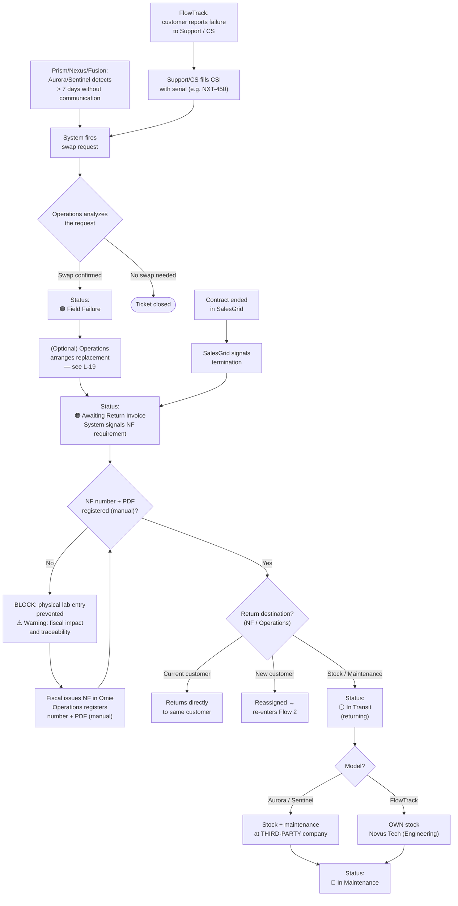

---
tags:
  - asset-management
  - flow
  - logistics
created: 2026-06-02
updated: 2026-06-09
status: closed
related:
  - "[[general-context]]"
  - "[[flow-02-provisioning-and-dispatch]]"
  - "[[flow-04-maintenance-and-repair]]"
---

# Flow 3: Reverse Logistics (Return)

> Owner: Amanda
> Status: ✅ Updated — revised 2026-06-09 (Inventory × Fiscal knowledge base)
> Updated: 2026-06-09

---

## 1. Overview

This flow covers the return of a device from the customer to Novus Tech. There are two distinct triggers: **contract end** (detected via SalesGrid) and **field failure** (CSI form filled in by Support).

**Field failure** depends on the device type:
- **Prism / Nexus / Fusion** — detected **remotely** via Aurora/Sentinel when the device stops communicating for **more than 7 days**.
- **FlowTrack** — no remote monitoring; failure is **reported by the customer** (e.g. pole broke, phone stopped charging).

In both cases, **nothing is done automatically**. The system only fires a **swap request for Operations to analyze** — every decision requires prior human analysis before retrieval begins.

The fiscal block is critical: a device can only physically enter the lab / RepairTech after the return invoice (NF) is issued.

---

## 2. Actors and roles

| Actor | Role |
|---|---|
| **SalesGrid** | Detects contract termination and fires trigger 1 |
| **Aurora / Sentinel** | Detect, for Prism/Nexus/Fusion, absence of communication for more than 7 days |
| **Customer** | Reports the failure to Support / CS — primary detection method for FlowTrack |
| **Support / CS** | Receives customer report; fills in the CSI form identifying the failed device |
| **Operations** | **Analyzes** the swap request and decides what to do — no automatic action occurs without this analysis |
| **Fiscal** | Issues the return NF in Omie |
| **RepairTech** (external company) | Receives and handles Prism/Nexus/Fusion maintenance |
| **Engineering** (internal room) | Receives and handles FlowTrack maintenance |
| **System** | Identifies the device by serial, fires the swap request for analysis, changes status, blocks entry without NF |

---

## 3. Triggers

### Trigger 1 — Contract end (SalesGrid)

SalesGrid signals termination via a field with value "CLOSED", "TERMINATION" or "CONTRACT ENDED". The system identifies the linked devices and moves them directly to 🟠 **Awaiting Return Invoice**.

> **Gap L-11:** Exact SalesGrid field to map after the termination flow migration.

### Trigger 2 — Field failure

Detection varies by device type. In none of the cases does the system act alone: everything goes through **Operations analysis**.

**Trigger 2A — Remote failure (Prism / Nexus / Fusion):**
Aurora/Sentinel detect that the device **has not communicated for more than 7 days** (fixed limit). The system automatically fires a **swap request for Operations to analyze**. Operations decides whether to initiate retrieval.

**Trigger 2B — Customer-reported failure (FlowTrack):**
With no remote monitoring, the customer contacts Support / CS reporting the issue (e.g. pole broke, phone won't charge). The agent fills in the CSI form identifying the device by **serial number** (e.g. NXT-450). Also applies to the failure of an isolated item from a FlowTrack kit.

---

## 4. CSI Form — relevant fields for this flow

| Field | Type | Notes |
|---|---|---|
| Category | Selection | Reverse logistics / Active issues |
| Summary | Short text | Problem description |
| Requester | Text | Novus Tech staff member name |
| Department | Text | Requester's department |
| Request Type | Selection | **Issue (Swap)** or **Reverse Logistics** |
| Operation | Text | Related customer and contract |
| Device serial number | Text | Key for the system to identify the asset |
| Detailed description | Long text | Detail the failure |
| Attachments | Upload | Photos / videos of the defect (drag & drop) |
| Priority | Selection | Low \| Medium \| High \| Urgent |

---

## 5. Main flow — Contract end (Trigger 1)

| Step | Who | What they do | What happens |
|---|---|---|---|
| 1 | SalesGrid | Contract status field updated | System detects termination |
| 2 | System | Identifies contract devices | Status → 🟠 **Awaiting Return Invoice** |
| 3 | System | Signals return NF requirement | — |
| 4 | Fiscal | Issues return NF in Omie | — |
| 5 | Operations / Fiscal | **Manually registers the return NF number and attaches the PDF** in the system | Block lifted |
| 6 | System | Updates status | ⚪ **In Transit** (returning) |
| 7 | RepairTech / Engineering | Device arrives; entry registered (destination by model — see 6A) | Status → 🔴 **In Maintenance** |

---

## 6. Alternative flow — Field failure (Trigger 2)

| Step | Who | What they do | What happens |
|---|---|---|---|
| 1a | Aurora / Sentinel | **(Prism/Nexus/Fusion)** Detects absence of communication > 7 days | System fires swap request |
| 1b | Support / CS | **(FlowTrack)** Receives customer report and fills CSI with serial | System fires swap request |
| 2 | **Operations** | **Analyzes** the swap request | Decides whether to initiate retrieval. **Nothing automatic without this analysis.** |
| 3 | System | Locates the device by serial number | Status → 🟠 **Field Failure** |
| 4 | System | Initiates reverse NF flow and notifies Omie | Status → 🟠 **Awaiting Return Invoice** |
| 5 | System | **Automatically reserves** a replacement device from stock | Status of replacement → ⚪ **Reserved** — re-enters Flow 2 |
| 6 | Fiscal | Issues return NF in Omie | — |
| 7 | Operations / Fiscal | **Manually registers the NF number and attaches the PDF** | Block lifted |
| 8 | System | Updates status | ⚪ **In Transit** (returning) |
| 9 | RepairTech / Engineering | Device arrives; entry registered (destination by model — see 6A) | Status → 🔴 **In Maintenance** |

> **Device replacement:** once Operations confirms the swap, the system **automatically reserves** a replacement device from stock, which re-enters Flow 2.

---

## 6A. Return routing by model and destination

When the return NF is issued, the **device destination is not unique**: it depends on the **model** and the **decision recorded in the return NF / by Operations**. This is a broad point of reverse logistics.

### Destination by model (maintenance)

| Model | Where it goes | Who performs maintenance |
|---|---|---|
| **Aurora / Sentinel** (Prism / Nexus / Fusion) | Stock and maintenance at a **third-party company** | External RepairTech (outsourced) — see Flow 4, Strand A |
| **FlowTrack** | **Novus Tech's own stock** | Internal Engineering — see Flow 4, Strand B |

### Return does not always go through stock

Not every device returning from the field goes to stock/maintenance. The return NF may determine that the device:

| Destination | When it occurs | System effect |
|---|---|---|
| **Stock / Maintenance** | Default case — device needs triage/repair or to return to stock | 🔴 In Maintenance (third-party or internal, per model) |
| **Directly to current customer** | Device returns to the same customer without going through the bench (e.g. simple logistic swap) | Remains linked to the same contract/customer |
| **Reassigned to new customer** | Device is redirected to another customer | Re-enters **Flow 2** (new dispatch) for the new customer/contract |

> **Note (Future Phase):** Routing by model and destination reflects the current fiscal/operational reality. Automation of destination recording (and its reflection in Omie) is Future Phase — in this phase, Operations manually records the destination when registering the return entry.

---

## 7. Exception flows

| Situation | What happens |
|---|---|
| **Support evaluates — no swap needed** | Ticket closed. Device remains in current status. |
| **Serial entered in CSI not found in system** | System displays error: *"Serial number not found. Please check and try again."* |
| **Device arrives at lab without return NF** | System **blocks** physical entry. Message: *"Return NF is mandatory. Its absence is a fiscal irregularity and compromises asset traceability."* |
| **SalesGrid has not yet migrated the termination field** | Trigger 1 unavailable. Contract-end returns must be initiated via CSI in the meantime. |

---

## 8. Business rules

- **BR-01:** The system locates the failed device **by serial number** (entered in CSI or identified by Aurora/Sentinel).
- **BR-02:** Status **🟠 Field Failure** is only set **after Operations analyzes and confirms the swap**. Detection (Aurora/Sentinel > 7 days or customer report via CSI) only generates a **swap request**.
- **BR-03:** The device **cannot physically enter** the lab without a registered return NF. System blocks with a fiscal warning.
- **BR-04:** Field failure **triggers no automatic action** — requires prior human analysis. Detection by type:
  - **Prism / Nexus / Fusion:** remote detection via Aurora/Sentinel (no communication for more than 7 days — **fixed limit**).
  - **FlowTrack:** manual detection, by customer report, via CSI form.
  - Once Operations confirms the swap, the system **automatically reserves** a replacement from stock.
- **BR-05:** The return NF is issued by Fiscal in Omie. In this phase **no native integration**, the number is **manually registered** in the system with **PDF upload**. Automatic capture via API = Future Phase (Back-end).
- **BR-06:** All serials of a FlowTrack kit are **linked to the same contract**. Failure of a single item is handled manually and generates a swap **of the affected item only**.
- **BR-07:** The **return destination depends on the model**: **Aurora/Sentinel (Prism/Nexus/Fusion)** → stock and maintenance at a **third-party company**; **FlowTrack** → **Novus Tech's own stock** (internal Engineering).
- **BR-08:** The return **does not always go through stock/maintenance**. Per the return NF / Operations decision, the device may return **directly to the current customer** or be **reassigned to a new customer** (re-entering Flow 2). Operations records the destination when registering the return entry.

---

## 9. States in this flow

```
🟢 In Operation (or ⚪ Delivered)
   │
   ├── [Contract end — SalesGrid]
   │       ↓
   │   🟠 Awaiting Return Invoice
   │
   └── [Field failure]
         • Prism/Nexus/Fusion: Aurora/Sentinel detects > 7 days without communication
         • FlowTrack: customer reports → CSI
           ↓
       Swap request → Operations ANALYZES
           ↓ (Operations confirms swap)
       🟠 Field Failure
           ↓
       🟠 Awaiting Return Invoice ← BLOCK: without NF, lab does not accept device
           ↓ (NF issued in Omie)
       ⚪ In Transit (returning)
           ↓ (arrived)
       🔴 In Maintenance
```

---

## 10. Data involved

| Field | Who fills | When |
|---|---|---|
| `Serial of failed device` | Support (CSI) | Trigger 2 |
| `Return type` | System (automatic) | Based on trigger |
| `Reason / Description` | Support (CSI) | Trigger 2 |
| `Attachments` | Support (CSI) | Trigger 2 |
| `Priority` | Support (CSI) | Trigger 2 |
| `Return NF Number` | Operations / Fiscal (manual) — *Future Phase: Omie API* | After trigger |
| `Return NF PDF` | Operations / Fiscal (upload) | Required to release entry |
| `Return destination` | Operations (own stock / third-party / current customer / new customer) | When registering return entry (see 6A) |
| `Lab entry date` | System (automatic) | When arrival is registered |

---

## 11. Integrations / external systems

| System | Purpose | Status |
|---|---|---|
| **SalesGrid** | Detect contract termination | Awaiting migration (L-11) |
| **Omie** | Return NF issuance | 🔮 **Future Phase (Back-end)** for automatic registration. In this phase, number + PDF **manual**. |
| **Correios** | Return tracking (Prism/Nexus/Fusion via RepairTech/third-party) | Polling — same logic as Flow 2 |

---

## 12. Open gaps and questions

| ID | Question | Status |
|---|---|---|
| L-11 | Exact SalesGrid field for termination — map after migration | ⏳ Blocked — awaiting migration |
| L-13 | Does lab / RepairTech return use Correios tracking? | ❓ Amanda + dev |
| L-16 | Is "Field Failure" an official state in the system or just a label/flag before "Awaiting Return Invoice"? | ✅ Closed — official visible state |
| L-19 | After Operations analysis, is the replacement reservation automatic (with stock → Flow 2) or manual? | ✅ Closed — automatic |
| L-20 | Is the 7-day communication limit fixed or configurable (by device type / customer)? | ✅ Closed — fixed at 7 days |

---

## 13. Diagram


