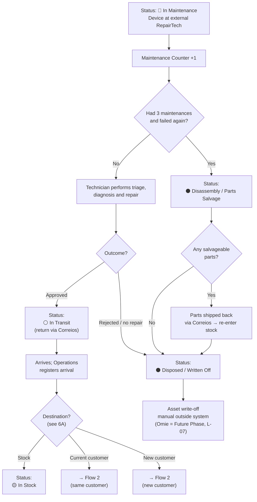
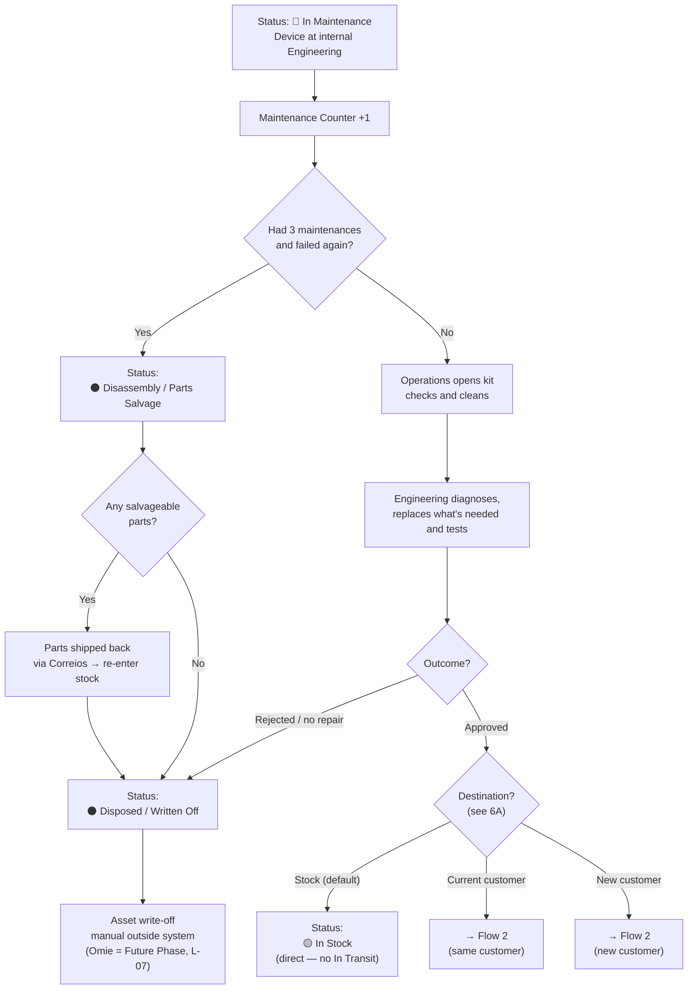

---
tags:
  - asset-management
  - flow
  - maintenance
created: 2026-06-02
updated: 2026-06-10
status: closed
related:
  - "[[general-context]]"
  - "[[flow-03-reverse-logistics]]"
---

# Flow 4: Maintenance and Repair

> Owner: Amanda
> Status: ✅ Updated — revised 2026-06-10 (removal of inspection reports; Omie as Future Phase)
> Updated: 2026-06-10

---

## 1. Overview

This flow covers what happens to a device after it arrives with status 🔴 **In Maintenance**. There are **two maintenance strands**, depending on device type:

- **RepairTech** (external outsourced company) — receives Prism, Nexus and Fusion (Aurora/Sentinel models); equipment stays at the **third-party's stock and maintenance facility**. After approval, destination is defined by Operations (stock, current customer or new customer — see 6A).
- **Engineering** (Novus Tech internal room) — receives FlowTrack kits in **own stock**. The company opens, checks, cleans and performs maintenance internally. After approval, default destination is own stock, but can also go to a customer (see 6A).

In this phase the system **does not record inspection reports**. What matters is: the device **went to maintenance** (status + counter) and what the **outcome** was — **Approved** (proceeds to destination) or **Rejected** (proceeds to disposal).

---

## 2. Actors and roles

| Actor | Role |
|---|---|
| **RepairTech** (external company) | Receives and performs maintenance on Prism / Nexus / Fusion |
| **Engineering** (internal) | Receives and performs maintenance on FlowTrack |
| **Technician** | Records the maintenance outcome (Approved / Rejected) and releases the device |
| **Fiscal** | Handles asset write-off when disposing — **outside the system** in this phase (Omie = Future Phase, L-07) |
| **System** | Increments counter, fires limit alerts, updates status |

---

## 3. Trigger

Device with status 🔴 **In Maintenance** registered in the system (entered via Flow 3).

---

## 4. Pre-conditions

- Device with status 🔴 **In Maintenance** (return NF already issued).
- Technician authenticated with **Maintenance** profile (RepairTech or Engineering).

---

## 5. Strand A — External RepairTech (Prism / Nexus / Fusion)

| Step | Who | What they do | What happens |
|---|---|---|---|
| 1 | System | Device enters maintenance | Maintenance Counter +1; alert if limit is reached |
| 2 | Technician (RepairTech) | Performs triage, diagnosis and repair | — |
| **3a — Approved** | Technician | Marks outcome as approved and releases device | Status → ⚪ **In Transit** (return) |
| 4a | System | Correios polling tracks return | — |
| 5a | Operations | Device arrives; registers arrival and **defines destination** (see 6A) | Status → 🟡 **In Stock** *(or directly to current / new customer)* |
| **3b — Rejected** | Technician | Marks outcome as rejected / no repair possible | See section 7 |

---

## 6. Strand B — Internal Engineering (FlowTrack)

| Step | Who | What they do | What happens |
|---|---|---|---|
| 1 | System | Device enters maintenance | Maintenance Counter +1; alert if limit is reached |
| 2 | Operations | Opens the kit, checks and cleans items | — |
| 3 | Engineering | Performs diagnosis, replaces what is needed and tests | — |
| **4a — Approved** | Technician | Marks outcome as approved and releases device | Status → 🟡 **In Stock** (direct — no In Transit) *or destination per 6A* |
| **4b — Rejected** | Technician | Marks outcome as rejected / no repair possible | See section 7 |

---

## 6A. Destination after maintenance

Once approved in testing, the device **does not have a single destination**. Operations defines the destination when releasing/receiving the equipment. The decision considers the model and commercial demand:

| Destination | When | Resulting status |
|---|---|---|
| **Stock** | Default case — replenish available stock. **FlowTrack** → Novus Tech's **own stock**; **Aurora/Sentinel** → **third-party's stock** (returns to Novus Tech via Correios when applicable) | 🟡 **In Stock** |
| **Current customer** | Device returns to the same customer it came from (e.g. pre-arranged swap) | Re-enters **Flow 2** (dispatch) for the same contract |
| **New customer** | Device is reassigned to another customer/contract | Re-enters **Flow 2** (dispatch) for the new contract |

> When the destination is a customer (current or new), dispatch follows the fiscal rules of **Flow 2** (stock write-off with NF + PDF, or `Pending Invoice` if the NF doesn't exist yet).

---

## 7. Rejection flow (both strands)

| Step | Who | What they do | What happens |
|---|---|---|---|
| 1 | Technician | Marks device as rejected / no repair possible | — |
| 2 | System | Updates status | ⚫ **Disposed / Written Off** |
| 3 | Fiscal | Performs asset write-off **outside the system** (Omie = Future Phase — L-07) | — |

> There are no longer inspection reports. The system records only the outcome (rejected) and final status (Disposed / Written Off).

---

## 8. Business rules

- **BR-01:** The `Maintenance Counter` is automatically incremented on each maintenance entry. It is the only mandatory history information — **whether** the device went to maintenance and **how many times**.
- **BR-02:** The `Maintenance Counter` limit is **3 maintenances per device**. Once the limit is reached, if the device **fails again**, it **does not go for normal repair** — it enters the **⚫ Disassembly / Parts Salvage** state. Salvageable parts are shipped back to Novus Tech **via Correios** and re-enter stock. If no parts are salvageable, the device proceeds directly to ⚫ **Disposed / Written Off**.
- **BR-03:** The maintenance outcome is **Approved** or **Rejected**. Approved → destination per 6A; Rejected / no repair possible → ⚫ Disposed / Written Off.
- **BR-04:** Prism/Nexus/Fusion (external RepairTech / third-party) goes through ⚪ **In Transit** before reaching stock.
- **BR-05:** FlowTrack (internal Engineering) goes **directly** to 🟡 **In Stock** upon approval — no transit.
- **BR-06:** An approved device **does not always return to stock**. Operations defines the destination: **stock** (own/third-party per model), **current customer** or **new customer**. Customer destinations re-enter **Flow 2** and follow its fiscal rules (NF + PDF / `Pending Invoice`).
- **BR-07:** On disposal, the system only marks ⚫ **Disposed / Written Off**. The **Omie asset write-off** is **Future Phase** — handled manually outside the system in this phase.

> Inspection report rules (profile that creates/views reports), the dynamic list of replaced parts and the mandatory content of rejection reports **do not exist in this version**.

---

## 9. States in this flow

```
🔴 In Maintenance
   │  (Maintenance Counter +1)
   │
   ├── [Had 3 maintenances and failed again]
   │       ↓
   │   ⚫ Disassembly / Parts Salvage
   │       ├── [parts salvageable] ──► shipped via Correios ──► re-enter stock
   │       └── [no salvageable parts]
   │               ↓
   │           ⚫ Disposed / Written Off
   │
   ├── STRAND A: External RepairTech / third-party (Prism / Nexus / Fusion)
   │   ├── [Approved]
   │   │       ↓
   │   │   ⚪ In Transit — return (via Correios)
   │   │       ↓
   │   │   DESTINATION (Operations defines — see 6A):
   │   │     ├── 🟡 In Stock
   │   │     ├── Current customer ──► (Flow 2)
   │   │     └── New customer     ──► (Flow 2)
   │   │
   │   └── [Rejected]
   │           ↓
   │       ⚫ Disposed / Written Off
   │
   └── STRAND B: Internal Engineering (FlowTrack)
       ├── [Approved]
       │       ↓
       │   DESTINATION (Operations defines — see 6A):
       │     ├── 🟡 In Stock  ← direct, no In Transit (default)
       │     ├── Current customer ──► (Flow 2)
       │     └── New customer     ──► (Flow 2)
       │
       └── [Rejected]
               ↓
           ⚫ Disposed / Written Off
```

---

## 10. Data involved

| Field | Who fills | Notes |
|---|---|---|
| `Maintenance Counter` | System (automatic) | +1 on each entry — core of the flow (how many times it went to maintenance) |
| `Test Result` | Technician | Approved \| Rejected |
| `Responsible Technician` | System (login) | Who registered the outcome |
| `Release Date` | System (automatic) | When technician confirms approval |
| `Diagnosis / Tests performed` | Technician | **Optional** — operational maintenance support; **not** an inspection report, not required |

> **Removed in this version:** `Replaced Parts`, `Rejection Reason`, `Salvaged Parts`, `What goes to disposal`.

---

## 11. Integrations / external systems

| System | Purpose | Notes |
|---|---|---|
| **Omie** | Asset write-off on disposal | 🔮 **Future Phase (Back-end)** — no integration in this phase; write-off done manually outside system (L-07) |
| **Correios** | Return tracking to stock (RepairTech/Prism/Nexus only) | Polling — same logic as Flow 2 |

---

## 12. Open gaps and questions

| ID | Question | Status |
|---|---|---|
| L-07 | Omie asset write-off on disposal — automatic or manual? | 🔮 **Deferred — Future Phase (Back-end)**. In this phase, manual write-off outside system |
| L-21 | Is "Disassembly / parts salvage" its own visible state? How do salvaged parts return to stock? | ✅ Closed — own visible state; salvaged parts returned via Correios and re-enter stock |

---

## 13. Diagrams

### Strand A — External RepairTech (Prism / Nexus / Fusion)



### Strand B — Internal Engineering (FlowTrack)


