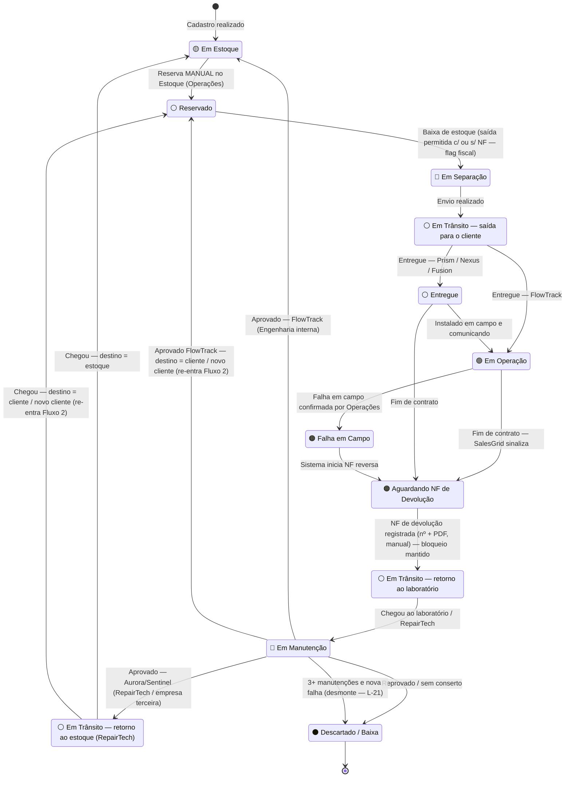

---
tags:
  - gestao-de-ativos
  - fluxo
  - diagrama
related:
  - "[[contexto-geral]]"
  - "[[fluxo-01-recebimento-e-cadastro]]"
  - "[[fluxo-02-provisionamento-e-saida]]"
  - "[[fluxo-03-logistica-reversa]]"
  - "[[fluxo-04-manutencao-e-reparo]]"
  - "[[divisao-de-tarefas]]"
---

# Diagrama Geral de Estados do Dispositivo

> Responsável: Amanda
> Status: ✅ Atualizado — revisado em 2026-06-09 (Estoque × Fiscal) — validar diagrama antes de passar ao dev
> Atualizado em: 2026-06-09

> **⚠️ Revisão 2026-06-09 (D-31 a D-35):** reserva manual; NF (saída e devolução) registrada manualmente + PDF (Omie = Fase Futura); **bloqueio fiscal de saída afrouxado** (flag `Pendente de Nota Fiscal` / `Baixa Definitiva` — dimensão paralela, ver abaixo); **bloqueio de devolução mantido**; destino pós-manutenção flexível (estoque / cliente atual / novo cliente).

---

## Todos os estados possíveis

| Status                           | Emoji | Quando ocorre                                                                                                                         |
| -------------------------------- | ----- | ------------------------------------------------------------------------------------------------------------------------------------- |
| Em Estoque                       | 🟡    | Após cadastro; após manutenção aprovada; após cancelamento de reserva                                                                 |
| Reservado                        | ⚪     | Reserva de contrato aprovada por Operações                                                                                            |
| Em Separação                     | 🔵    | NF de saída registrada — dispositivo liberado para envio                                                                              |
| Em Trânsito — saída              | ⚪     | Envio realizado em direção ao cliente                                                                                                 |
| Entregue                         | ⚪     | Entregue ao cliente — somente Prism / Nexus / Fusion (aguardando instalação)                                                        |
| Em Operação                      | 🟢    | FlowTrack: ao ser entregue. Prism/Nexus/Fusion: ao ser comissionado no Aurora/Sentinel. Sub-status: ✅ Comunicando / ⚠️ Falha na Comunicação |
| Falha em Campo                   | 🟠    | Troca confirmada por Operações após detecção remota (Aurora/Sentinel > 7 dias sem comunicar) ou relato do cliente (FlowTrack, via CSI)        |
| Aguardando NF de Devolução       | 🟠    | Sistema aguarda NF de retorno — **BLOQUEIO fiscal**                                                                                   |
| Em Trânsito — retorno            | ⚪     | NF emitida — dispositivo a caminho do laboratório / RepairTech / ENG                                                                          |
| Em Manutenção                    | 🔴    | Dispositivo na bancada — RepairTech externa (Prism/Nexus) ou Engenharia interna (FlowTrack)                                                     |
| Em Trânsito — retorno ao estoque | ⚪     | Somente após RepairTech externa (Prism/Nexus aprovado) — voltando à Novus Tech via Correios                                                    |
| Descartado / Baixa               | ⚫     | Reprovado na manutenção / fim de vida útil                                                                                            |

> **Nota sobre "Em Trânsito — retorno ao estoque":** Este estado aplica-se apenas a dispositivos que passaram pela **RepairTech externa** (Prism/Nexus/Fusion). Dispositivos que passaram pela **Engenharia interna** (FlowTrack) vão diretamente para 🟡 Em Estoque, pois a manutenção é realizada dentro da própria empresa.

---

## Dimensão fiscal paralela (saída) — D-34

Além do status **logístico** acima, a **baixa de estoque na saída** carrega um **status fiscal** independente:

| Status Fiscal | Quando ocorre |
|---|---|
| 🟡 **Pendente de Nota Fiscal** | Baixa de estoque feita **sem** o número da NF — saída permitida, mas marcada para regularização |
| ✅ **Baixa Definitiva** | NF informada (número + PDF) — na baixa ou em regularização posterior |

> Essa flag **não** substitui o status logístico — ela o acompanha. Ex.: um dispositivo pode estar 🔵 *Em Separação* **e** 🟡 *Pendente de Nota Fiscal*. Não há, nesta fase, bloqueio rígido na saída (substituído por esta flag). O **bloqueio rígido permanece apenas na entrada da devolução** (Aguardando NF de Devolução, ver abaixo).

---

## Diagrama de estados completo

> **Destino após a manutenção (D-35):** ao ser aprovado, o dispositivo nem sempre volta ao estoque — pode ir **direto ao cliente atual** ou ser **remanejado a um novo cliente**, re-entrando no Fluxo 2 (estado ⚪ Reservado).

---

## Regras de transição (resumo para o dev)

| De | Para | Condição obrigatória |
|---|---|---|
| Em Estoque | Reservado | **Reserva MANUAL** no ambiente de Estoque (Operações). Não automática; não refletida no Omie (D-32) |
| Reservado | Em Separação | **Baixa de estoque** — saída permitida **com ou sem** NF. Flag fiscal: `Baixa Definitiva` (com NF + PDF) ou `Pendente de Nota Fiscal` (sem NF) (D-34) |
| Em Separação | Em Trânsito saída | Envio registrado com código de rastreio |
| Em Trânsito saída | Em Operação | API Correios confirma entrega **E** tipo = FlowTrack |
| Em Trânsito saída | Entregue | API Correios confirma entrega **E** tipo = Prism / Nexus / Fusion |
| Entregue | Em Operação | Comissionado no Aurora / Sentinel — Prism/Nexus/Fusion (D-28) |
| Em Operação | Falha em Campo | **Após análise de Operações.** Detecção: Aurora/Sentinel > 7 dias sem comunicar (Prism/Nexus/Fusion) ou relato do cliente via CSI (FlowTrack) |
| Em Operação | Aguardando NF de Devolução | SalesGrid sinaliza encerramento de contrato |
| Entregue | Aguardando NF de Devolução | SalesGrid sinaliza encerramento de contrato |
| Falha em Campo | Aguardando NF de Devolução | Automático — sistema inicia fluxo de NF reversa |
| Aguardando NF de Devolução | Em Trânsito retorno | `Número da NF de Devolução` registrado **manualmente** + **PDF anexado** — bloqueio liberado (mantido; D-15/D-31) |
| Em Trânsito retorno | Em Manutenção | Entrada registrada — destino por modelo: Aurora/Sentinel → terceira; FlowTrack → estoque próprio (D-35) |
| Em Manutenção | Em Trânsito retorno ao estoque | Técnico registra aprovação **E** tipo = Prism / Nexus / Fusion (RepairTech externa / terceira) |
| Em Manutenção | Em Estoque | Técnico registra aprovação **E** tipo = FlowTrack (Engenharia interna — direto), **se destino = estoque** |
| Em Manutenção | Reservado | Aprovado **E** destino = cliente atual / novo cliente → re-entra no Fluxo 2 (D-35) |
| Em Trânsito retorno ao estoque | Em Estoque | Chegada registrada na Novus Tech (rastreio Correios), **se destino = estoque** |
| Em Trânsito retorno ao estoque | Reservado | Chegada registrada **E** destino = cliente / novo cliente → re-entra no Fluxo 2 (D-35) |
| Em Manutenção | Descartado / Baixa | Técnico registra reprovação / sem conserto; **ou** após 3 manutenções + nova falha → desmonte e reaproveitamento de peças (L-21) |

---

## Lacunas que afetam este diagrama

| ID | Impacto no diagrama | Status |
|---|---|---|
| ~~L-08~~ | Entregue → Em Operação: detecção de comissionamento | ✅ Fechado — Aurora/Sentinel (D-28) |
| ~~L-09~~ | Em Manutenção: limite do contador | ✅ Fechado — 3 manutenções; depois desmonte (D-16) |
| ~~L-14~~ | Em Trânsito retorno ao estoque: Correios ou manual? | ✅ Fechado — Correios (D-19) |
| ~~L-15~~ | Falha em Campo: reserva automática de substituto | ✅ Revogada — só após análise de Operações (D-27 revisado) |
| ~~L-17~~ | Kit FlowTrack: tratamento de seriais e falha de item | ✅ Fechado — seriais no mesmo contrato; falha tratada manualmente (D-23) |
| L-07 | Transição → Descartado: baixa patrimonial no Omie | 🔮 Diferida — Fase Futura (D-37). Nesta fase o sistema só marca ⚫ Descartado; baixa manual fora do sistema |
| L-16 | "Falha em Campo" é estado oficial visível ou apenas um flag/rótulo? | ❓ Aberta |
| L-19 | Após análise de Operações, a reserva do substituto é automática ou manual? | ❓ Aberta |
| L-20 | O limite de 7 dias sem comunicação é fixo ou configurável? | ❓ Aberta |
| L-21 | "Desmonte / reaproveitamento de peças" é um estado próprio? Como as peças voltam ao estoque? | ❓ Aberta |
