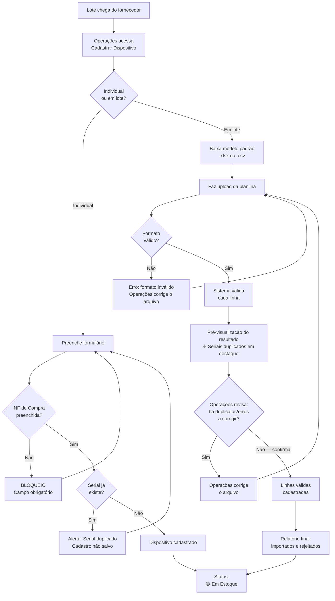

---
tags:
  - gestao-de-ativos
  - fluxo
created: 2026-06-02
status: fechado
related:
  - "[[contexto-geral]]"
  - "[[fluxo-02-provisionamento-e-saida]]"
  - "[[lacunas-abertas]]"
  - "[[divisao-de-tarefas]]"
---

# Fluxo 1: Recebimento e Cadastro de Dispositivos

> Responsável: Amanda
> Status: ✅ Fechado
> Atualizado em: 2026-06-02

---

## 1. Visão geral

Este fluxo cobre o momento em que um lote de dispositivos chega do fornecedor. O setor de Operações registra cada dispositivo no sistema — individualmente ou em lote via planilha — e ao final cada dispositivo fica disponível no estoque com status **Em Estoque**, pronto para ser reservado em um contrato.

---

## 2. Atores e papéis

| Ator          | Papel                                                                                                                        |
| ------------- | ---------------------------------------------------------------------------------------------------------------------------- |
| **Operações** | Único ator humano. Realiza o cadastro individual ou importa a planilha em lote.                                              |
| **Sistema**   | Valida campos obrigatórios, verifica duplicatas de serial, atualiza status e disponibiliza modelo de planilha para download. |

---

## 3. Gatilho

Chegada de um lote de dispositivos do fornecedor.

---

## 4. Pré-condições

- Usuário de Operações autenticado no sistema.
- Nota Fiscal de compra do lote disponível (número e data de emissão são campos obrigatórios — sem eles o cadastro não pode ser concluído).

---

## 5. Fluxo principal (caminho feliz)

### 5.1 Cadastro individual

| Passo | Quem      | O que faz                                       | O que acontece                   |
| ----- | --------- | ----------------------------------------------- | -------------------------------- |
| 1     | Operações | Acessa **Estoque → Cadastrar novo dispositivo** | Formulário de cadastro é exibido |
| 2     | Operações | Preenche todos os campos obrigatórios           | —                                |
| 3     | Sistema   | Verifica se o `Número de Serial` já existe      | —                                |
| 4     | Sistema   | Confirma o cadastro                             | Dispositivo registrado           |
| 5     | Sistema   | Atualiza o status                               | 🟡 **Em Estoque**                |

### 5.2 Cadastro em lote

| Passo | Quem      | O que faz                                                                     | O que acontece                                           |
| ----- | --------- | ----------------------------------------------------------------------------- | -------------------------------------------------------- |
| 1     | Operações | Acessa **Estoque → Importar dispositivos em lote**                            | Tela de importação exibida                               |
| 2     | Operações | Clica em **"Baixar modelo padrão"**                                           | Download de planilha `.xlsx` e `.csv` disponível         |
| 3     | Operações | Preenche a planilha com os dados do lote                                      | —                                                        |
| 4     | Operações | Faz upload do arquivo                                                         | —                                                        |
| 5     | Sistema   | Valida o formato do arquivo                                                   | —                                                        |
| 6     | Sistema   | Valida cada linha: campos obrigatórios e seriais únicos                       | Linhas inválidas são marcadas com motivo                 |
| 7     | Sistema   | Exibe **pré-visualização** do resultado, **destacando os seriais duplicados** | Operações revisa antes de confirmar                      |
| 8     | Operações | Corrige as duplicatas/erros (se houver) e confirma a importação               | —                                                        |
| 9     | Sistema   | Importa as linhas válidas                                                     | Dispositivos registrados                                 |
| 10    | Sistema   | Exibe relatório final de importação                                           | Total importado / total rejeitado (com motivo por linha) |
| 11    | Sistema   | Atualiza status de cada dispositivo importado                                 | 🟡 **Em Estoque**                                        |

---

## 6. Fluxos alternativos e de exceção

| Situação                                      | O que o sistema faz                                                                                                                                       |
| --------------------------------------------- | --------------------------------------------------------------------------------------------------------------------------------------------------------- |
| **NF de Compra não preenchida (individual)**  | Bloqueia o cadastro. Exibe: *"Número da NF de Compra é obrigatório."* Não permite avançar.                                                                |
| **Serial duplicado (individual)**             | Alerta imediato: *"Já existe um dispositivo com este serial no sistema."* Cadastro não é salvo. Operações deve corrigir e tentar novamente.               |
| **Serial duplicado (lote)**                   | A linha com o serial duplicado é rejeitada. As demais linhas válidas são importadas normalmente. O relatório final indica quais seriais foram rejeitados. |
| **Formato de arquivo inválido (lote)**        | Erro: *"Formato não reconhecido. Use .xlsx ou .csv com o modelo padrão."* Upload cancelado.                                                               |
| **Campos obrigatórios em branco na planilha** | A linha é rejeitada com indicação do campo faltante. As demais são importadas normalmente.                                                                |

---

## 7. Regras de negócio

- **RN-01:** Somente **Operações** pode cadastrar dispositivos.
- **RN-02:** `Número da NF de Compra` e `Data de Emissão` são **obrigatórios**. Sem eles, o cadastro não é concluído.
- **RN-03:** O `Número de Serial` é a **chave primária** — deve ser único no sistema. O sistema impede duplicatas em tempo real.
- **RN-04:** O cadastro em lote aceita apenas `.xlsx` e `.csv` **no modelo padrão** disponibilizado pelo sistema.
- **RN-05:** O modelo padrão de planilha deve estar disponível para download direto na tela de importação em lote.
- **RN-06:** O status inicial de qualquer dispositivo cadastrado é sempre 🟡 **Em Estoque**.
- **RN-07:** No cadastro em lote, antes de confirmar a importação, o sistema deve exibir uma **pré-visualização** dos resultados com os **seriais duplicados em destaque**, permitindo que Operações corrija antes de concluir.

---

## 8. Estados

Neste fluxo há apenas uma transição:

```
[Inexistente no sistema] ──► 🟡 Em Estoque
```

---

## 9. Dados envolvidos

### Campos obrigatórios (formulário e planilha)

| Campo                    | Tipo              | Observação                                    |
| ------------------------ | ----------------- | --------------------------------------------- |
| `Número da NF de Compra` | Texto             | Documento fiscal do lote — obrigatório        |
| `Data de Emissão da NF`  | Data (DD/MM/AAAA) | Data da NF de compra — obrigatório            |
| `Número de Serial`       | Texto             | Chave primária — deve ser único               |
| `Tipo`                   | Seleção           | Pressão \| Nexus \| Fusion \| DataHub FlowTrack |
| `Tecnologia`             | Seleção           | CAT1 Bis \| NB-IoT                            |
| `Fornecedor`             | Seleção           | Placa \| Sensor \| Conjunto Completo          |
| `Ano de Fabricação`      | Ano (AAAA)        | —                                             |

### Campos opcionais

| Campo             | Tipo  | Observação                |
| ----------------- | ----- | ------------------------- |
| `Número do IMEI`  | Texto | Identificador do SIM card |
| `Número do ICCID` | Texto | Identificador do SIM card |

### Dados gerados automaticamente pelo sistema

| Campo | Valor atribuído |
|---|---|
| `Status` | 🟡 Em Estoque |
| `Data de Cadastro` | Data e hora do registro |
| `Contador de Manutenções` | 0 (valor inicial) |

---

## 10. Integrações / sistemas externos

Nenhuma. O cadastro é 100% interno.

---

## 11. Lacunas e perguntas em aberto

| ID   | Pergunta                                                                                                                 | Responsável |
| ---- | ------------------------------------------------------------------------------------------------------------------------ | ----------- |
| P-02 | Quais são os níveis de acesso de CS e Engenharia? Eles podem visualizar o cadastro de dispositivos no módulo de estoque? | Amanda      |

---

## 12. Diagrama



