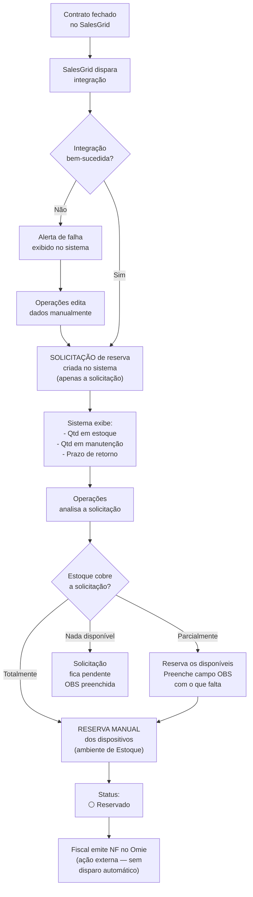
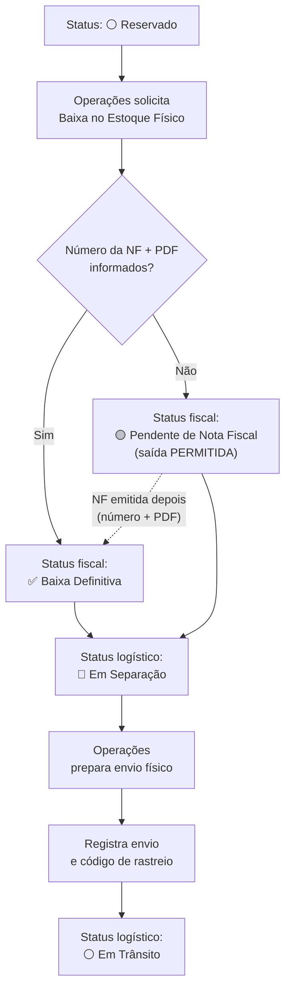
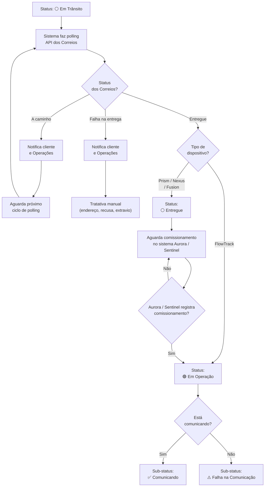

---
tags:
  - gestao-de-ativos
  - fluxo
created: 2026-06-02
updated: 2026-06-09
status: fechado
related:
  - "[[contexto-geral]]"
  - "[[fluxo-01-recebimento-e-cadastro]]"
  - "[[fluxo-03-logistica-reversa]]"
---

# Fluxo 2: Provisionamento e Saída para Campo

> Responsável: Amanda
> Status: ✅ Fechado — revisado em 2026-06-09 (base de conhecimento Estoque × Fiscal)
> Atualizado em: 2026-06-09

---

## 1. Visão geral

Este fluxo cobre todo o caminho de um dispositivo desde a reserva (originada por um contrato fechado no SalesGrid) até chegar ao cliente e entrar em operação. É o fluxo central do negócio e envolve três equipes (Operações, Financeiro/Fiscal e o próprio sistema de rastreamento dos Correios), além do SalesGrid e dos Correios como integrações externas ativas. **O Omie permanece como ERP onde o Fiscal emite a NF, mas sem integração nativa nesta fase** — o número da NF é registrado manualmente no sistema, com o PDF anexado (ver revisão acima).

O fluxo é dividido em três etapas:
- **2A — Reserva:** contrato no SalesGrid gera a **solicitação** de dispositivos; Operações **reserva manualmente** os dispositivos disponíveis no Estoque.
- **2B — NF e Baixa de Estoque:** Fiscal emite a NF no Omie; Operações **registra o número e anexa o PDF** no sistema; a baixa de estoque libera o envio (com tratamento de pendência fiscal — ver 5A).
- **2C — Envio e Rastreamento:** dispositivo enviado; Correios rastreia; cliente recebe; status final depende do tipo de dispositivo.

---

## 2. Atores e papéis

| Ator                          | Papel                                                                                                                                                                                          |
| ----------------------------- | ---------------------------------------------------------------------------------------------------------------------------------------------------------------------------------------------- |
| **SalesGrid** (sistema externo) | Dispara a criação automática da **solicitação** de reserva ao fechar um contrato                                                                                                               |
| **Operações**                 | **Reserva manualmente** os dispositivos disponíveis no Estoque; registra o número da NF e anexa o PDF; prepara o envio físico                                                                  |
| **Financeiro / Fiscal**       | Emite a NF de saída no Omie                                                                                                                                                                    |
| **Omie** (sistema externo)    | ERP onde a NF de saída é emitida. **Sem integração nativa nesta fase** — o número da NF é registrado manualmente no sistema. Captura automática via API = Fase Futura (Back-end), ver seção 10 |
| **Sistema**                   | Cria a solicitação a partir do SalesGrid, controla a reserva manual, registra a NF e o PDF, marca pendência fiscal quando a NF não é informada, registra rastreio, atualiza status               |
| **Correios** (API externa)    | Fornece status de rastreamento via polling                                                                                                                                                     |
| **Cliente**                   | Recebe o dispositivo; para Prism/Nexus/Fusion, realiza a instalação                                                                                                                          |

---

## 3. Gatilho

Contrato fechado no SalesGrid contendo campo de tipo e quantidade de dispositivos preenchido.

---

## 4. Pré-condições

- O campo de tipo e quantidade de dispositivos **já existe no SalesGrid** e deve estar preenchido no contrato.
- Pelo menos um dispositivo com status 🟡 **Em Estoque** deve existir para o tipo solicitado (caso contrário, a aprovação será parcial ou negada).
- A NF de compra dos dispositivos deve estar cadastrada (os dispositivos precisam já estar no sistema).

---

## 5. Fluxo principal (caminho feliz)

### Etapa 2A — Reserva via SalesGrid

| Passo | Quem | O que faz | O que acontece |
|---|---|---|---|
| 1 | SalesGrid | Contrato fechado — campo de dispositivos preenchido | Integração dispara para o sistema de gestão |
| 2 | Sistema | Lê tipo e quantidade do contrato no SalesGrid | **Solicitação** de reserva criada automaticamente (apenas a solicitação — não a reserva dos dispositivos) |
| 3 | Sistema | Exibe para Operações: estoque disponível, quantidade em manutenção, prazo de retorno da manutenção | — |
| 4 | Operações | Analisa a solicitação | — |
| 5 | Operações | **Reserva manualmente** os dispositivos disponíveis em estoque (seleção individual no ambiente de Estoque) | — |
| 6 | Sistema | Atualiza status dos dispositivos reservados | ⚪ **Reservado** |
| 7 | Fiscal | Emite a NF de saída no Omie (ação externa — sem disparo automático do sistema nesta fase) | — |

> **🔒 Reserva 100% manual:** A reserva de dispositivos é um processo **manual, restrito ao ambiente de Estoque**. O sistema **não gera reserva automática** e **não reflete a reserva no Omie** — o ERP não suporta esse conceito de reserva, agravado pela divergência de nomenclatura (Estoque usa o nome operacional, ex: `NVT-45205`; Fiscal usa o nome técnico/contábil, ex: `Prism-v2-R3`). O SalesGrid apenas cria a **solicitação**; quem reserva os dispositivos é sempre Operações.

> **Caso de aprovação parcial:** se o estoque for menor que a quantidade solicitada, Operações reserva o que há disponível, preenche o campo **OBS** com o que faltou e quando será enviado (ex: *"Solicitaram 100. Enviamos 80. Os 20 restantes serão enviados em xx/xx/xxxx"*), e o sistema registra a solicitação como parcialmente atendida.

---

### Etapa 2B — NF e Baixa de Estoque

| Passo | Quem | O que faz | O que acontece |
|---|---|---|---|
| 1 | Fiscal | Acessa o Omie e emite a NF de saída | NF emitida no Omie |
| 2 | Operações | Solicita a **Baixa no Estoque Físico** dos dispositivos reservados | Sistema exibe o campo obrigatório `Número da NF de Saída` + `Upload do PDF da NF` |
| 3 | Operações | **Informa o número da NF e anexa o PDF** | — |
| 4 | Sistema | Valida e registra a NF | Status fiscal → ✅ **Baixa Definitiva**; status logístico → 🔵 **Em Separação** |
| 5 | Operações | Prepara o envio físico do dispositivo | — |
| 6 | Operações | Registra o envio no sistema (com código de rastreio) | — |
| 7 | Sistema | Atualiza status | ⚪ **Em Trânsito** |

> **🟡 Saída sem NF:** Ao solicitar a Baixa no Estoque Físico, **se o número da NF NÃO for informado**, o sistema **permite a saída física** mesmo assim, mas marca o lote com o status fiscal **`Pendente de Nota Fiscal`**. O dispositivo segue para 🔵 **Em Separação** → ⚪ **Em Trânsito** carregando essa pendência, que **deve ser regularizada** quando a NF for emitida (número + PDF) — momento em que o status fiscal passa a **`Baixa Definitiva`**. Detalhe completo da regra na **seção 5A**.

> **Por que afrouxar o bloqueio:** Substituímos o bloqueio rígido anterior (que impedia qualquer saída sem NF) por este modelo de pendência fiscal porque, nesta fase, o foco é a **eficiência operacional** e o **saneamento gradual** do estoque físico (meta > 90% de confiabilidade). Travar a expedição engessaria a operação; marcar a pendência mantém o rastro auditável sem parar o negócio.

> **Fase Futura (Back-end):** Quando houver integração com o Omie, o número da NF poderá ser **puxado automaticamente** via API (NF-e Consultas) e o PDF/DANFE recuperado via Utilitários de NF-e, eliminando a digitação manual. Ver seção 10.

#### 5A — Regra de Baixa de Estoque (resumo para o dev)

O comportamento da baixa de estoque físico, ponto a ponto:

1. Ao solicitar a **Baixa no Estoque Físico**, o sistema obrigatoriamente **solicita** o `Número da NF de Saída` e o **upload do PDF da NF**.
2. **Se o número NÃO for inserido:** o sistema **permite a saída física**, mas marca o lote com o status fiscal **`Pendente de Nota Fiscal`**. A expedição (Em Separação → Em Trânsito) ocorre normalmente.
3. **Se o número FOR inserido (com PDF):** o sistema valida a operação e define o status fiscal como **`Baixa Definitiva`**.
4. Um lote/dispositivo em **`Pendente de Nota Fiscal`** deve aparecer destacado para Operações/Fiscal e pode ser **regularizado a qualquer momento** informando o número da NF e anexando o PDF — passando então para **`Baixa Definitiva`**.

> O status **fiscal** (`Pendente de NF` / `Baixa Definitiva`) é uma **dimensão paralela** ao status **logístico** (Reservado → Em Separação → Em Trânsito → …). Um dispositivo pode estar 🔵 Em Separação **e** `Pendente de Nota Fiscal` ao mesmo tempo.

---

### Etapa 2C — Envio, Rastreamento e Entrega

| Passo | Quem | O que faz | O que acontece |
|---|---|---|---|
| 1 | Sistema | Inicia polling na API dos Correios com o código de rastreio | — |
| 2 | API Correios | Retorna status de rastreamento | Sistema atualiza visualização |
| 3 | Sistema | Notifica cliente e Operações a cada mudança de status | — |
| 4 | API Correios | Retorna status **"Entregue"** | — |
| 5 | Sistema | Verifica o tipo do dispositivo | Caminho diverge (ver abaixo) |

**Se o dispositivo for FlowTrack:**
- Status muda diretamente para 🟢 **Em Operação** (não requer instalação).

**Se o dispositivo for Prism, Nexus ou Fusion:**
- Status muda para ⚪ **Entregue** (dispositivo está com o cliente, aguardando instalação e comissionamento).
- O cliente instala o dispositivo e o registra como **Comissionado** no sistema Aurora (Prism) ou Sentinel (Nexus/Fusion).
- A integração com Aurora/Sentinel detecta o comissionamento → status muda para 🟢 **Em Operação**.
- Em **Em Operação**, o sistema verifica a comunicação do dispositivo e atribui um sub-status:
  - ✅ **Comunicando** — dispositivo transmitindo dados normalmente.
  - ⚠️ **Falha na Comunicação** — dispositivo registrado como em operação, mas sem transmissão de dados.

---

## 6. Fluxos alternativos e de exceção

| Situação | O que acontece |
|---|---|
| **Integração SalesGrid falha ao criar solicitação** | Sistema exibe alerta de falha. Os campos da solicitação ficam editáveis para Operações corrigir e criar manualmente. |
| **Dados da solicitação chegam errados do SalesGrid** | Os campos são editáveis antes da aprovação. Operações corrige e aprova. |
| **Estoque insuficiente (parcial)** | Operações aprova o que há disponível, preenche OBS com o que falta e a data prevista de envio do restante. |
| **Dispositivos faltantes chegam ao estoque (complemento)** | Operações completa a solicitação parcial **manualmente**, selecionando os dispositivos **em massa** (ex: seleciona de uma vez os 20 que faltavam). Ver RN-08. |
| **Estoque zerado para o tipo solicitado** | Operações não consegue aprovar. Preenche OBS com a situação e a previsão. A solicitação fica pendente. |
| **NF de Saída ainda não emitida no momento da baixa** | A saída física é **permitida**; o lote é marcado como `Pendente de Nota Fiscal`. A pendência deve ser regularizada (número + PDF) assim que a NF for emitida — passando a `Baixa Definitiva`. |
| **PDF da NF indisponível, apenas o número** | Registra o número e mantém o lote sinalizado como pendente do anexo até o PDF ser carregado. (A `Baixa Definitiva` plena exige número **e** PDF.) |
| **Falha na entrega (endereço errado, recusa, extravio)** | API Correios retorna status de falha. Cliente e Operações são notificados. Tratativa manual entre as partes. |

---

## 7. Regras de negócio

- **RN-01:** A saída física **não é mais bloqueada** pela ausência da NF. Ao dar baixa no estoque, o sistema **solicita** o `Número da NF de Saída` + PDF; se não informado, **permite a saída** e marca o lote como `Pendente de Nota Fiscal`; se informado, define `Baixa Definitiva`. *(Substitui o antigo bloqueio rígido.)*
- **RN-02:** Não há prazo máximo para emissão/regularização da NF. Um lote pode permanecer `Pendente de Nota Fiscal` indefinidamente, mas deve ficar **destacado** para Operações/Fiscal até virar `Baixa Definitiva`.
- **RN-10:** A **reserva de dispositivos é 100% manual**, restrita ao ambiente de Estoque. O sistema não gera reserva automática nem a reflete no Omie. O SalesGrid cria apenas a **solicitação**.
- **RN-11:** A baixa de estoque exige o `Número da NF de Saída` **e** o **upload do PDF da NF** para ser concluída como `Baixa Definitiva`.
- **RN-12:** Nesta fase **não há integração nativa com o Omie**. O número da NF é registrado manualmente. A captura automática via API é Fase Futura (Back-end).
- **RN-03:** Para dispositivos **FlowTrack**, o status muda para 🟢 **Em Operação** automaticamente ao ser confirmada a entrega (não requer instalação).
- **RN-04:** Para dispositivos **Prism, Nexus e Fusion**, o status fica ⚪ **Entregue** após a entrega. O avanço para 🟢 **Em Operação** ocorre quando o sistema Aurora/Sentinel registrar o comissionamento do dispositivo (requer integração — ver seção 10).
- **RN-07:** Todo dispositivo que entra em 🟢 **Em Operação** recebe automaticamente um sub-status de comunicação: **Comunicando** ou **Falha na Comunicação**, com base na leitura do sistema Aurora/Sentinel.
- **RN-05:** Em caso de aprovação parcial, o campo OBS deve ser preenchido com a quantidade faltante e a data prevista de envio.
- **RN-06:** O polling da API dos Correios deve notificar tanto o cliente quanto Operações em cada mudança de status. O polling ocorre **no máximo duas vezes ao dia**, em horários estratégicos.
- **RN-08:** O complemento de uma solicitação parcial é **manual**. Quando os dispositivos faltantes chegam ao estoque, Operações pode selecioná-los **em massa** para concluir a solicitação pendente.
- **RN-09:** A notificação de rastreamento ao cliente ocorre pelo **sistema** (se o cliente tiver acesso) ou por **e-mail e/ou WhatsApp** (se não tiver acesso).

---

## 8. Estados neste fluxo

**Status logístico:**

```
🟡 Em Estoque
   │
   ▼ (reserva MANUAL no Estoque)
⚪ Reservado
   │
   ▼ (baixa de estoque — saída permitida com ou sem NF)
🔵 Em Separação
   │
   ▼ (envio físico realizado)
⚪ Em Trânsito
   │
   ▼ (API Correios: Entregue)
   ├──► [FlowTrack] ──────────────► 🟢 Em Operação
   │
   └──► [Prism / Nexus / Fusion] ──► ⚪ Entregue
                                           │
                                           ▼ (comissionado no Aurora / Sentinel)
                                        🟢 Em Operação
                                           │
                                           ├──► ✅ Sub-status: Comunicando
                                           └──► ⚠️ Sub-status: Falha na Comunicação
```

**Status fiscal (dimensão paralela, a partir da baixa de estoque):**

```
Baixa de Estoque
   ├──► [NF informada + PDF] ──► ✅ Baixa Definitiva
   └──► [sem NF]            ──► 🟡 Pendente de Nota Fiscal
                                    │
                                    ▼ (NF emitida — número + PDF anexado)
                                ✅ Baixa Definitiva
```

---

## 9. Dados envolvidos

| Campo | Quem preenche | Em qual etapa |
|---|---|---|
| `Cliente` | SalesGrid (automático) | 2A |
| `Contrato` | SalesGrid (automático) | 2A |
| `Natureza da Operação` | SalesGrid (automático) | Comodato \| Venda \| Remessa para Locação \| Demonstração |
| `Fornecedor Conectividade` | Operações | 2A — vínculo técnico. Opções: **ConnectOne** \| **NetPlus** |
| `Frequência de Comunicação` | Operações | 2A — nº de vezes/dia que o dispositivo transmite dados |
| `Quantidade solicitada` | SalesGrid (automático) | 2A |
| `Tipo de dispositivo solicitado` | SalesGrid (automático) | Aurora / Sentinel / FlowTrack |
| `Dispositivos selecionados` | Operações | 2A |
| `OBS de aprovação parcial` | Operações | 2A (se parcial) |
| `Número da NF de Saída` | Operações (manual) — *Fase Futura: API Omie* | 2B |
| `PDF da NF de Saída` | Operações (upload) | 2B — obrigatório para `Baixa Definitiva` |
| `Status Fiscal` | Sistema (`Pendente de Nota Fiscal` ou `Baixa Definitiva`) | 2B |
| `Código de rastreio` | Operações | 2B |
| `Status de rastreamento` | API Correios (automático) | 2C |
| `Data de entrega confirmada` | API Correios (automático) | 2C |

---

## 10. Integrações / sistemas externos

| Sistema | Finalidade | Observação |
|---|---|---|
| **SalesGrid** | Leitura do contrato fechado (tipo + qtd de dispositivos) → cria a **solicitação** | Campo já existe no SalesGrid — apenas mapear. A reserva em si é manual (RN-10). |
| **Omie** | 🔮 **Fase Futura (Back-end)** — criar pedido de venda e puxar o número da NF de saída após a emissão | Nesta fase **não há integração nativa**: o número da NF é registrado **manualmente** e o PDF anexado. Quando implementada: APIs NF-e Consultas, Utilitários de NF-e, Pedidos de Venda, Faturamento de Pedido. |
| **Correios (API SRO/SIGEP)** | Rastreamento do envio | Via **polling** (não há webhooks). Intervalo: **no máximo duas vezes ao dia**, em horários estratégicos (T-02 definida). |
| **Aurora** | Detectar comissionamento e status de comunicação de dispositivos **Prism** | Integração nova — a ser especificada pelo dev. Necessária para transição Entregue → Em Operação e para sub-status Comunicando / Falha na Comunicação. |
| **Sentinel** | Detectar comissionamento e status de comunicação de dispositivos **Nexus** e **Fusion** | Integração nova — mesma lógica da Aurora. |
| **E-mail (serviço transacional)** | Notificar o cliente sobre rastreamento, se ele não tiver acesso ao sistema | Provedor a definir (T-05) |
| **WhatsApp** | Notificar o cliente sobre rastreamento, se ele não tiver acesso ao sistema | Provedor a definir — ex: WhatsApp Business API (T-05) |

---

## 11. Lacunas e perguntas em aberto

| ID       | Pergunta                                                                                                            | Status                                                                                                            |
| -------- | ------------------------------------------------------------------------------------------------------------------- | ----------------------------------------------------------------------------------------------------------------- |
| T-04     | Omie: o sistema dispara o faturamento automaticamente ou apenas cria o pedido e consulta a NF após o Fiscal emitir? | 🔮 **Diferida — Fase Futura (Back-end)**. Nesta fase a NF é manual.                                        |
| T-05     | Quais serviços de e-mail e WhatsApp serão usados para as notificações ao cliente?                                   | ⏳ Dev                                                                                                             |

---

## 12. Diagramas

### Diagrama 2A — Reserva via SalesGrid



### Diagrama 2B — NF e Baixa de Estoque (bloqueio afrouxado)



> 🔮 **Fase Futura:** com integração Omie, o ramo "Número da NF" seria preenchido automaticamente (API NF-e Consultas) e o PDF recuperado via Utilitários de NF-e.

### Diagrama 2C — Rastreamento e Entrega


