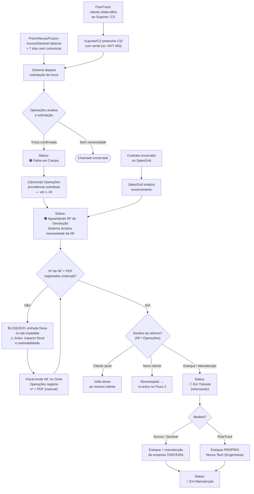

---
tags:
  - gestao-de-ativos
  - fluxo
  - logistica
created: 2026-06-02
updated: 2026-06-09
status: fechado
related:
  - "[[contexto-geral]]"
  - "[[fluxo-02-provisionamento-e-saida]]"
  - "[[fluxo-04-manutencao-e-reparo]]"
  - "[[decisoes-2026-06-09-estoque-x-fiscal]]"
---

# Fluxo 3: Logística Reversa (Retorno)

> Responsável: Amanda
> Status: ✅ Atualizado — revisado em 2026-06-09 (base de conhecimento Estoque × Fiscal)
> Atualizado em: 2026-06-09

> **⚠️ Revisão 2026-06-09 — Estoque × Fiscal (D-31, D-35):**
> - A **NF de devolução** continua sendo emitida pelo Fiscal no Omie, mas, nesta fase **sem integração nativa**, o número é **registrado manualmente** no sistema com **upload do PDF** (D-31). Captura automática via API = Fase Futura (Back-end).
> - O **bloqueio fiscal de entrada** sem NF de devolução **permanece** (D-15) — diferente da saída, que foi afrouxada. A NF de devolução é o "GPS fiscal" do retorno.
> - **Roteamento por modelo no retorno (D-35):** a NF de retorno pode determinar destinos distintos por modelo de equipamento — **Aurora/Sentinel (Prism/Nexus/Fusion)** vão para o **estoque e manutenção de uma empresa terceira**; **FlowTrack** vai para o **estoque próprio da Novus Tech**. Além disso, **nem todo dispositivo volta ao estoque**: ele pode retornar direto ao **cliente atual** ou ser **remanejado para um novo cliente** (ver seção 6A).

---

## 1. Visão geral

Este fluxo cobre o retorno de um dispositivo do cliente para a Novus Tech. Existem dois gatilhos distintos: **fim de contrato** (detectado via SalesGrid) e **falha em campo** (formulário CSI preenchido pelo Suporte).

A **falha em campo** depende do tipo de dispositivo:
- **Prism / Nexus / Fusion** — detectada **remotamente** via Aurora/Sentinel quando o dispositivo deixa de comunicar por **mais de 7 dias**.
- **FlowTrack** — não há monitoramento remoto; a falha é **relatada pelo cliente** (ex: haste quebrou, celular parou de carregar).

Em ambos os casos, **nada é feito automaticamente**. O sistema apenas dispara uma **solicitação de troca para Operações analisar** — toda decisão exige análise humana prévia antes de iniciar o recolhimento.

O bloqueio fiscal é crítico: o dispositivo só pode dar entrada física no laboratório / RepairTech após a emissão da NF de devolução.

---

## 2. Atores e papéis

| Ator | Papel |
|---|---|
| **SalesGrid** | Detecta encerramento de contrato e dispara gatilho 1 |
| **Aurora / Sentinel** | Detectam, para Prism/Nexus/Fusion, a ausência de comunicação por mais de 7 dias |
| **Cliente** | Relata a falha ao Suporte / CS — principal forma de detecção para FlowTrack |
| **Suporte / CS** | Recebem o relato do cliente; preenchem o formulário CSI identificando o dispositivo com falha |
| **Operações** | **Analisa** a solicitação de troca e decide o que fazer — nenhuma ação automática ocorre sem essa análise |
| **Fiscal** | Emite a NF de devolução no Omie |
| **RepairTech** (empresa externa) | Recebe e trata Prism/Nexus/Fusion em manutenção |
| **Engenharia** (sala interna) | Recebe e trata FlowTrack em manutenção |
| **Sistema** | Identifica o dispositivo por serial, dispara a solicitação de troca para análise, muda status, bloqueia entrada sem NF |

---

## 3. Gatilhos

### Gatilho 1 — Fim de contrato (SalesGrid)

SalesGrid sinaliza encerramento por campo com valor "FECHADO", "ENCERRAMENTO" ou "CONTRATO ENCERRADO". O sistema identifica os dispositivos vinculados e os move diretamente para 🟠 **Aguardando NF de Devolução**.

> **Lacuna L-11:** Campo exato no SalesGrid a mapear após a migração do fluxo de encerramento.

### Gatilho 2 — Falha em campo

A detecção varia conforme o tipo de dispositivo. Em nenhum dos casos o sistema age sozinho: tudo passa por **análise de Operações**.

**Gatilho 2A — Falha remota (Prism / Nexus / Fusion):**
Aurora/Sentinel detectam que o dispositivo **deixou de comunicar por mais de 7 dias**. O sistema dispara automaticamente uma **solicitação de troca para Operações analisar**. Operações decide se aciona o recolhimento.

**Gatilho 2B — Falha relatada pelo cliente (FlowTrack):**
Como não há monitoramento remoto, o cliente entra em contato com o Suporte / CS relatando o problema (ex: haste quebrou, celular não carrega). O atendente preenche o formulário CSI identificando o dispositivo pelo **número de série** (ex: NXT-450). Vale também para a falha de um item isolado de um kit FlowTrack.

---

## 4. Formulário CSI — campos relevantes para este fluxo

| Campo | Tipo | Observação |
|---|---|---|
| Categoria | Seleção | Logística reversa / Problemas ativos |
| Resumo | Texto curto | Descrição do problema |
| Solicitante | Texto | Nome do colaborador Novus Tech |
| Departamento | Texto | Setor do solicitante |
| Tipo de Solicitação | Seleção | **Problema (Troca)** ou **Logística Reversa** |
| Operação | Texto | Cliente e contrato relacionado |
| Número de série do dispositivo | Texto | Chave para o sistema identificar o ativo |
| Descrição detalhada | Texto longo | Detalhar a falha |
| Anexos | Upload | Fotos / vídeos do defeito (drag & drop) |
| Prioridade | Seleção | Baixa \| Média \| Alta \| Urgente |

---

## 5. Fluxo principal — Fim de contrato (Gatilho 1)

| Passo | Quem | O que faz | O que acontece |
|---|---|---|---|
| 1 | SalesGrid | Campo de status do contrato atualizado | Sistema detecta encerramento |
| 2 | Sistema | Identifica dispositivos do contrato | Status → 🟠 **Aguardando NF de Devolução** |
| 3 | Sistema | Sinaliza a necessidade da NF de devolução | — |
| 4 | Fiscal | Emite NF de retorno no Omie | — |
| 5 | Operações / Fiscal | **Registra manualmente o número da NF de devolução e anexa o PDF** no sistema | Bloqueio liberado |
| 6 | Sistema | Atualiza status | ⚪ **Em Trânsito** (retornando) |
| 7 | RepairTech / Engenharia | Dispositivo chega; entrada registrada (destino por modelo — ver 6A) | Status → 🔴 **Em Manutenção** |

---

## 6. Fluxo alternativo — Falha em campo (Gatilho 2)

| Passo | Quem | O que faz | O que acontece |
|---|---|---|---|
| 1a | Aurora / Sentinel | **(Prism/Nexus/Fusion)** Detecta ausência de comunicação > 7 dias | Sistema dispara solicitação de troca |
| 1b | Suporte / CS | **(FlowTrack)** Recebe relato do cliente e preenche o CSI com o serial | Sistema dispara solicitação de troca |
| 2 | **Operações** | **Analisa** a solicitação de troca | Decide se aciona o recolhimento. **Nada automático sem esta análise.** |
| 3 | Sistema | Localiza o dispositivo pelo número de série | Status → 🟠 **Falha em Campo** |
| 4 | Sistema | Inicia fluxo de NF reversa e notifica Omie | Status → 🟠 **Aguardando NF de Devolução** |
| 5 | Operações | **(Opcional)** Providencia o substituto para o cliente | Ver lacuna **L-19** (reserva automática ou manual?) |
| 6 | Fiscal | Emite NF de devolução no Omie | — |
| 7 | Operações / Fiscal | **Registra manualmente o número da NF e anexa o PDF** | Bloqueio liberado |
| 8 | Sistema | Atualiza status | ⚪ **Em Trânsito** (retornando) |
| 9 | RepairTech / Engenharia | Dispositivo chega; entrada registrada (destino por modelo — ver 6A) | Status → 🔴 **Em Manutenção** |

> **Substituição do dispositivo:** a antiga regra de reserva automática de substituto foi **revogada** (ver D-27 revisado). A substituição só ocorre após a análise de Operações. Se e como o sistema reserva o substituto automaticamente após essa decisão é a lacuna **L-19**.

---

## 6A. Roteamento do retorno por modelo e destino (D-35)

Quando a NF de devolução é emitida, o **destino do dispositivo não é único**: depende do **modelo** e da **decisão registrada na NF de retorno / por Operações**. Este é um ponto amplo da logística reversa.

### Destino por modelo (manutenção)

| Modelo | Para onde vai | Quem faz a manutenção |
|---|---|---|
| **Aurora / Sentinel** (Prism / Nexus / Fusion) | Estoque e manutenção de uma **empresa terceira** | RepairTech externa (terceirizada) — ver Fluxo 4, Vertente A |
| **FlowTrack** | **Estoque próprio da Novus Tech** | Engenharia interna — ver Fluxo 4, Vertente B |

### O retorno nem sempre passa pelo estoque

Nem todo dispositivo que volta de campo segue para o estoque/manutenção. A NF de retorno pode determinar que o dispositivo:

| Destino | Quando ocorre | Efeito no sistema |
|---|---|---|
| **Estoque / Manutenção** | Caso padrão — dispositivo precisa de triagem/reparo ou de retornar ao estoque | 🔴 Em Manutenção (terceira ou interna, conforme modelo) |
| **Direto ao cliente atual** | Dispositivo volta ao mesmo cliente sem passar pela bancada (ex: troca logística simples) | Permanece vinculado ao mesmo contrato/cliente |
| **Remanejado para novo cliente** | Dispositivo é redirecionado a outro cliente | Re-entra no **Fluxo 2** (nova saída) para o novo cliente/contrato |

> **Nota (Fase Futura):** O roteamento por modelo e por destino reflete a realidade fiscal/operacional atual. A automação do registro desses destinos (e o reflexo no Omie) é Fase Futura — nesta fase, Operações registra o destino manualmente ao dar entrada do retorno.

---

## 7. Fluxos de exceção

| Situação | O que acontece |
|---|---|
| **Suporte avalia — não há necessidade de troca** | Chamado encerrado. Dispositivo permanece no status atual. |
| **Serial informado no CSI não encontrado no sistema** | Sistema exibe erro: *"Número de série não encontrado. Verifique e tente novamente."* |
| **Dispositivo chega ao lab sem NF de devolução** | Sistema **bloqueia** a entrada física. Mensagem: *"NF de devolução obrigatória. A ausência desta NF é irregularidade fiscal e compromete a rastreabilidade do ativo."* |
| **SalesGrid ainda não migrou o campo de encerramento** | Gatilho 1 indisponível. Retorno por fim de contrato deve ser iniciado via CSI enquanto isso. |

---

## 8. Regras de negócio

- **RN-01:** O sistema localiza o dispositivo com falha **pelo número de série** (informado no CSI ou identificado pelo Aurora/Sentinel).
- **RN-02:** O status **🟠 Falha em Campo** só é definido **após Operações analisar e confirmar a troca**. A detecção (Aurora/Sentinel > 7 dias ou relato do cliente via CSI) apenas gera uma **solicitação de troca**.
- **RN-03:** O dispositivo **não pode dar entrada física** no laboratório sem NF de devolução registrada. Sistema bloqueia com aviso fiscal.
- **RN-04:** A falha em campo **não dispara nenhuma ação automática** — exige análise humana prévia. Detecção por tipo:
  - **Prism / Nexus / Fusion:** detecção remota via Aurora/Sentinel (sem comunicação por mais de 7 dias).
  - **FlowTrack:** detecção manual, por relato do cliente, via formulário CSI.
  - A reserva de um substituto, se houver, ocorre **somente após decisão de Operações** (ver L-19).
- **RN-05 (revisada — D-31):** A NF de devolução é emitida pelo Fiscal no Omie. Nesta fase **sem integração nativa**, o número é **registrado manualmente** no sistema com **upload do PDF**. Captura automática via API = Fase Futura (Back-end).
- **RN-06:** Todos os seriais de um kit FlowTrack ficam **vinculados ao mesmo contrato**. A falha de um único item é tratada manualmente e gera troca **apenas do item afetado**.
- **RN-07 (nova — D-35):** O **destino do retorno depende do modelo**: **Aurora/Sentinel (Prism/Nexus/Fusion)** → estoque e manutenção de **empresa terceira**; **FlowTrack** → **estoque próprio** da Novus Tech (Engenharia interna).
- **RN-08 (nova — D-35):** O retorno **nem sempre passa pelo estoque/manutenção**. Conforme a NF de retorno / decisão de Operações, o dispositivo pode voltar **direto ao cliente atual** ou ser **remanejado a um novo cliente** (re-entrando no Fluxo 2). Operações registra o destino ao dar entrada do retorno.

---

## 9. Estados neste fluxo

```
🟢 Em Operação (ou ⚪ Entregue)
   │
   ├── [Fim de contrato — SalesGrid]
   │       ↓
   │   🟠 Aguardando NF de Devolução
   │
   └── [Falha em campo]
         • Prism/Nexus/Fusion: Aurora/Sentinel detecta > 7 dias sem comunicar
         • FlowTrack: cliente relata → CSI
           ↓
       Solicitação de troca → Operações ANALISA
           ↓ (Operações confirma a troca)
       🟠 Falha em Campo
           ↓
       🟠 Aguardando NF de Devolução ← BLOQUEIO: sem NF, lab não recebe o dispositivo
           ↓ (NF emitida no Omie)
       ⚪ Em Trânsito (retornando)
           ↓ (chegou)
       🔴 Em Manutenção
```

---

## 10. Dados envolvidos

| Campo | Quem preenche | Quando |
|---|---|---|
| `Serial do dispositivo com falha` | Suporte (CSI) | Gatilho 2 |
| `Tipo de retorno` | Sistema (automático) | Baseado no gatilho |
| `Motivo / Descrição` | Suporte (CSI) | Gatilho 2 |
| `Anexos` | Suporte (CSI) | Gatilho 2 |
| `Prioridade` | Suporte (CSI) | Gatilho 2 |
| `Número da NF de Devolução` | Operações / Fiscal (manual) — *Fase Futura: API Omie* | Após gatilho |
| `PDF da NF de Devolução` | Operações / Fiscal (upload) | Obrigatório para liberar a entrada |
| `Destino do retorno` | Operações (estoque próprio / terceira / cliente atual / novo cliente) | Ao dar entrada do retorno (ver 6A) |
| `Data de entrada no laboratório` | Sistema (automático) | Ao registrar chegada |

---

## 11. Integrações / sistemas externos

| Sistema | Finalidade | Status |
|---|---|---|
| **SalesGrid** | Detectar encerramento de contrato | Aguarda migração (L-11) |
| **Omie** | Emissão da NF de devolução | 🔮 **Fase Futura (Back-end)** para registro automático. Nesta fase, número + PDF **manuais** (D-31). |
| **Correios** | Rastreamento do retorno (Prism/Nexus/Fusion via RepairTech/terceira) | Polling — mesma lógica do Fluxo 2 |

---

## 12. Lacunas e perguntas em aberto

| ID | Pergunta | Status |
|---|---|---|
| L-11 | Campo exato no SalesGrid para encerramento — mapear após migração | ⏳ Bloqueado — aguarda migração |
| L-13 | O retorno ao laboratório / RepairTech usa rastreamento dos Correios? | ❓ Amanda + dev |
| L-16 | "Falha em Campo" é um estado oficial no sistema ou apenas um rótulo/flag antes de "Aguardando NF"? | ❓ Amanda |
| ~~L-15~~ | ~~Como funciona a reserva automática do substituto?~~ | ✅ **Revogada** — substituição só após análise de Operações (D-27 revisado) |
| ~~L-17~~ | ~~Falha de um único item do kit FlowTrack~~ | ✅ Fechado — manual; todos os seriais vinculados ao mesmo contrato (D-23) |
| L-19 | Após a análise de Operações, a reserva do substituto é automática (com estoque → Fluxo 2) ou manual? | ❓ Amanda |
| L-20 | O limite de 7 dias sem comunicação é fixo ou configurável (por tipo de dispositivo / cliente)? | ❓ Amanda + dev |

---

## 13. Diagrama


