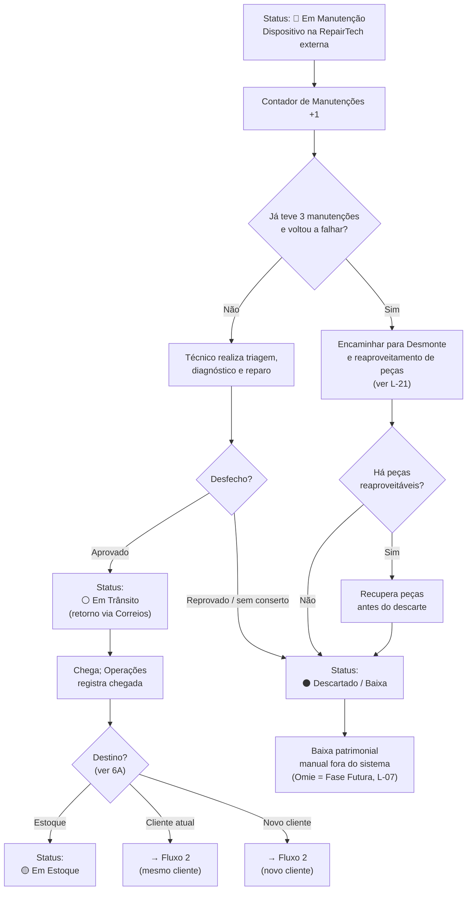
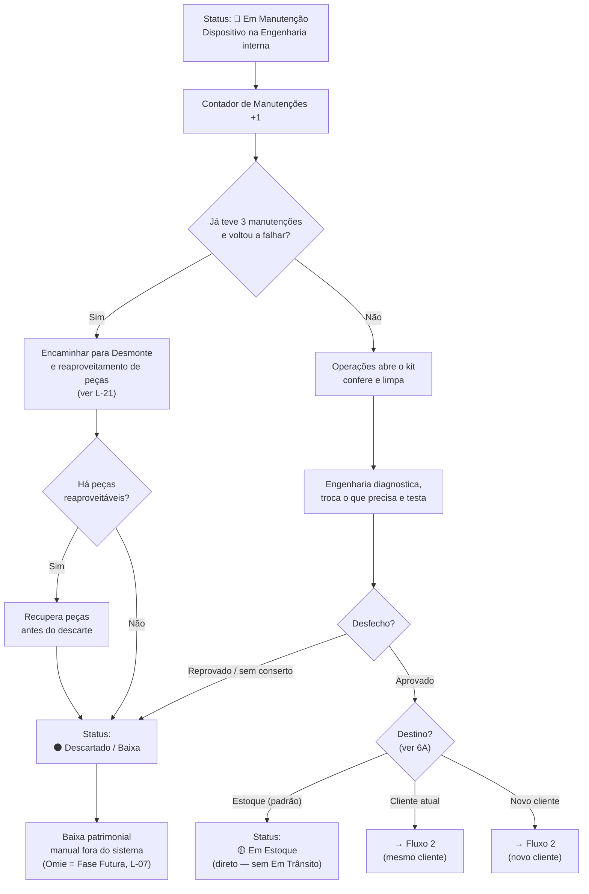

---
tags:
  - gestao-de-ativos
  - fluxo
  - manutencao
created: 2026-06-02
updated: 2026-06-10
status: fechado
related:
  - "[[contexto-geral]]"
  - "[[fluxo-03-logistica-reversa]]"
  - "[[decisoes-2026-06-10-remocao-laudos-e-omie-futuro]]"
---

# Fluxo 4: Manutenção e Reparo

> Responsável: Amanda
> Status: ✅ Atualizado — revisado em 2026-06-10 (remoção de laudos; Omie como Fase Futura)
> Atualizado em: 2026-06-10

> **⚠️ Revisão 2026-06-10 (D-36, D-37):** Os **laudos de manutenção foram removidos**. Para o objetivo atual, basta saber **se o dispositivo foi à manutenção** e **quantas vezes** (contador). Não há mais documento de laudo, peças trocadas, motivo detalhado de reprovação nem campo de peças reaproveitadas. Mantêm-se: contador + limite de 3, e o desfecho **Aprovado / Reprovado** (que decide destino vs. descarte). A **baixa patrimonial no Omie** passa a 🔮 **Fase Futura** — nesta fase o sistema apenas marca ⚫ Descartado / Baixa; a baixa patrimonial é tratada fora do sistema.

> **⚠️ Revisão 2026-06-09 — Estoque × Fiscal (D-35):** A aprovação na manutenção **nem sempre devolve o dispositivo ao estoque original**. Conforme decisão de Operações / NF, o dispositivo aprovado pode: voltar ao **estoque** (próprio da Novus Tech para FlowTrack; via empresa **terceira** para Aurora/Sentinel), seguir **direto ao cliente atual**, ou ser **remanejado para um novo cliente** (re-entrando no Fluxo 2). Ver a **seção 6A — Destino após a manutenção**.

---

## 1. Visão geral

Este fluxo cobre o que acontece com um dispositivo após chegar com status 🔴 **Em Manutenção**. Existem **duas vertentes de manutenção**, dependendo do tipo de dispositivo:

- **RepairTech** (empresa externa terceirizada) — recebe Prism, Nexus e Fusion (modelos Aurora/Sentinel); o equipamento fica no **estoque e manutenção da terceira**. Após aprovação, o destino é definido por Operações (estoque, cliente atual ou novo cliente — ver 6A).
- **Engenharia** (sala interna da Novus Tech) — recebe kits FlowTrack no **estoque próprio**. A empresa abre, confere, limpa e realiza a manutenção internamente. Após aprovação, o destino padrão é o estoque próprio, mas também pode seguir para cliente (ver 6A).

Nesta fase o sistema **não registra laudo**. O que importa é: o dispositivo **foi para a manutenção** (status + contador) e qual o **desfecho** — **Aprovado** (segue para o destino) ou **Reprovado** (segue para descarte).

---

## 2. Atores e papéis

| Ator | Papel |
|---|---|
| **RepairTech** (empresa externa) | Recebe e realiza manutenção de Prism / Nexus / Fusion |
| **Engenharia** (interna) | Recebe e realiza manutenção de FlowTrack |
| **Técnico** | Registra o desfecho da manutenção (Aprovado / Reprovado) e libera o dispositivo |
| **Fiscal** | Trata a baixa patrimonial ao descartar — **fora do sistema** nesta fase (Omie = Fase Futura, L-07) |
| **Sistema** | Incrementa contador, dispara alertas de limite, atualiza status |

---

## 3. Gatilho

Dispositivo com status 🔴 **Em Manutenção** registrado no sistema (entrou pelo Fluxo 3).

---

## 4. Pré-condições

- Dispositivo com status 🔴 **Em Manutenção** (NF de devolução já emitida).
- Técnico autenticado com perfil **Manutenção** (RepairTech ou Engenharia).

---

## 5. Vertente A — RepairTech externa (Prism / Nexus / Fusion)

| Passo | Quem | O que faz | O que acontece |
|---|---|---|---|
| 1 | Sistema | Dispositivo entra em manutenção | Contador de Manutenções +1; alerta se atingir limite |
| 2 | Técnico (RepairTech) | Realiza triagem, diagnóstico e reparo | — |
| **3a — Aprovado** | Técnico | Marca o desfecho como aprovado e libera o dispositivo | Status → ⚪ **Em Trânsito** (retorno) |
| 4a | Sistema | Polling Correios acompanha retorno | — |
| 5a | Operações | Dispositivo chega; registra chegada e **define o destino** (ver 6A) | Status → 🟡 **Em Estoque** *(ou direto ao cliente / novo cliente)* |
| **3b — Reprovado** | Técnico | Marca o desfecho como reprovado / sem conserto | Ver seção 7 |

---

## 6. Vertente B — Engenharia interna (FlowTrack)

| Passo | Quem | O que faz | O que acontece |
|---|---|---|---|
| 1 | Sistema | Dispositivo entra em manutenção | Contador de Manutenções +1; alerta se atingir limite |
| 2 | Operações | Abre o kit, confere e limpa os itens | — |
| 3 | Engenharia | Realiza diagnóstico, troca o que precisa e testa | — |
| **4a — Aprovado** | Técnico | Marca o desfecho como aprovado e libera o dispositivo | Status → 🟡 **Em Estoque** (direto — sem Em Trânsito) *ou destino conforme 6A* |
| **4b — Reprovado** | Técnico | Marca o desfecho como reprovado / sem conserto | Ver seção 7 |

---

## 6A. Destino após a manutenção (aprovado — D-35)

Aprovado nos testes, o dispositivo **não tem destino único**. Operações define o destino ao liberar/receber o equipamento. A decisão considera o modelo e a demanda comercial:

| Destino | Quando | Status resultante |
|---|---|---|
| **Estoque** | Caso padrão — repor o estoque disponível. **FlowTrack** → estoque **próprio** da Novus Tech; **Aurora/Sentinel** → estoque da **empresa terceira** (volta à Novus Tech via Correios quando aplicável) | 🟡 **Em Estoque** |
| **Cliente atual** | O dispositivo retorna ao mesmo cliente de onde saiu (ex: troca já casada) | Re-entra no **Fluxo 2** (saída) para o mesmo contrato |
| **Novo cliente** | O dispositivo é remanejado para outro cliente/contrato | Re-entra no **Fluxo 2** (saída) para o novo contrato |

> Quando o destino é um cliente (atual ou novo), a saída segue as regras fiscais do **Fluxo 2** (baixa de estoque com NF + PDF, ou `Pendente de Nota Fiscal` se a NF ainda não existir).

---

## 7. Fluxo de reprovação (ambas as vertentes)

| Passo | Quem | O que faz | O que acontece |
|---|---|---|---|
| 1 | Técnico | Marca o dispositivo como reprovado / sem conserto | — |
| 2 | Sistema | Atualiza status | ⚫ **Descartado / Baixa** |
| 3 | Fiscal | Realiza a baixa patrimonial **fora do sistema** (Omie = Fase Futura — L-07) | — |

> Não há mais laudo de reprovação. O sistema registra apenas o desfecho (reprovado) e o status final (Descartado / Baixa).

---

## 8. Regras de negócio

- **RN-01:** O `Contador de Manutenções` é incrementado automaticamente a cada entrada em manutenção. É a única informação obrigatória de histórico — **se** o dispositivo foi à manutenção e **quantas vezes**.
- **RN-02:** O limite do `Contador de Manutenções` é de **3 manutenções por dispositivo**. Atingido o limite, se o dispositivo **voltar a apresentar problema**, ele **não segue para reparo normal** — é encaminhado para **desmonte e reaproveitamento de peças**. Se não houver nenhuma peça reaproveitável, segue para ⚫ **Descartado / Baixa**.
- **RN-03:** O desfecho da manutenção é **Aprovado** ou **Reprovado**. Aprovado → destino conforme 6A; Reprovado / sem conserto → ⚫ Descartado / Baixa.
- **RN-04:** Prism/Nexus/Fusion (RepairTech externa / empresa terceira) passa por ⚪ **Em Trânsito** antes de chegar ao estoque.
- **RN-05:** FlowTrack (Engenharia interna) vai **diretamente** para 🟡 **Em Estoque** ao ser aprovado — sem trânsito.
- **RN-06 (D-35):** O dispositivo aprovado **nem sempre retorna ao estoque**. Operações define o destino: **estoque** (próprio/terceira conforme modelo), **cliente atual** ou **novo cliente**. Destinos a cliente re-entram no **Fluxo 2** e seguem suas regras fiscais (NF + PDF / `Pendente de Nota Fiscal`).
- **RN-07 (D-37):** Ao descartar, o sistema apenas marca ⚫ **Descartado / Baixa**. A **baixa patrimonial no Omie** é **Fase Futura** — tratada manualmente fora do sistema nesta fase.

> **Removido em 2026-06-10 (D-36):** as regras de laudo (perfil que cria/visualiza laudo), a lista dinâmica de peças trocadas e o conteúdo obrigatório do laudo de reprovação **não existem mais**.

---

## 9. Estados neste fluxo

```
🔴 Em Manutenção
   │  (Contador de Manutenções +1)
   │
   ├── [Já teve 3 manutenções e voltou a falhar]
   │       ↓
   │   Desmonte / reaproveitamento de peças (ver L-21)
   │       ↓
   │   ⚫ Descartado / Baixa
   │
   ├── VERTENTE A: RepairTech externa / empresa terceira (Prism / Nexus / Fusion)
   │   ├── [Aprovado]
   │   │       ↓
   │   │   ⚪ Em Trânsito — retorno (via Correios)
   │   │       ↓
   │   │   DESTINO (Operações define — ver 6A):
   │   │     ├── 🟡 Em Estoque
   │   │     ├── Cliente atual ──► (Fluxo 2)
   │   │     └── Novo cliente  ──► (Fluxo 2)
   │   │
   │   └── [Reprovado]
   │           ↓
   │       ⚫ Descartado / Baixa
   │
   └── VERTENTE B: Engenharia interna (FlowTrack)
       ├── [Aprovado]
       │       ↓
       │   DESTINO (Operações define — ver 6A):
       │     ├── 🟡 Em Estoque  ← direto, sem Em Trânsito (padrão)
       │     ├── Cliente atual ──► (Fluxo 2)
       │     └── Novo cliente  ──► (Fluxo 2)
       │
       └── [Reprovado]
               ↓
           ⚫ Descartado / Baixa
```

---

## 10. Dados envolvidos

| Campo | Quem preenche | Observação |
|---|---|---|
| `Contador de Manutenções` | Sistema (automático) | +1 a cada entrada — núcleo do fluxo (quantas vezes foi à manutenção) |
| `Resultado dos Testes` | Técnico | Aprovado \| Reprovado |
| `Técnico Responsável` | Sistema (login) | Quem registrou o desfecho |
| `Data de Liberação` | Sistema (automático) | Ao técnico confirmar aprovação |
| `Diagnóstico / Testes realizados` | Técnico | **Opcional** — apoio operacional da manutenção; **não** é laudo nem obrigatório |

> **Removidos em 2026-06-10 (D-36):** `Peças Trocadas`, `Motivo da Reprovação`, `Peças Reaproveitadas`, `O que vai para descarte`.

---

## 11. Integrações / sistemas externos

| Sistema | Finalidade | Observação |
|---|---|---|
| **Omie** | Baixa patrimonial ao descartar | 🔮 **Fase Futura (Back-end)** — sem integração nesta fase; baixa feita manualmente fora do sistema (L-07) |
| **Correios** | Rastreamento do retorno ao estoque (apenas RepairTech/Prism/Nexus) | Polling — mesma lógica do Fluxo 2 |

---

## 12. Lacunas e perguntas em aberto

| ID | Pergunta | Responsável |
|---|---|---|
| L-07 | ~~Baixa patrimonial no Omie ao descartar — automático ou manual?~~ | 🔮 **Diferida — Fase Futura (Back-end)** (D-37). Nesta fase, baixa manual fora do sistema |
| ~~L-09~~ | ~~Qual o limite do contador de manutenções?~~ | ✅ Fechado — **3 manutenções**; depois, desmonte/reaproveitamento (ver D-16) |
| ~~L-14~~ | ~~O "Em Trânsito" da RepairTech usa Correios ou é manual?~~ | ✅ Fechado — usa rastreamento dos **Correios** (D-19) |
| ~~L-17~~ | ~~Falha de um único item do kit FlowTrack~~ | ✅ Fechado — manual; somente o item afetado (D-23) |
| L-21 | "Desmonte / reaproveitamento de peças" é um estado próprio e visível no sistema? Como as peças reaproveitadas são registradas/retornam ao estoque? | ❓ Amanda |

---

## 13. Diagrama

### Vertente A — RepairTech externa (Prism / Nexus / Fusion)



### Vertente B — Engenharia interna (FlowTrack)


